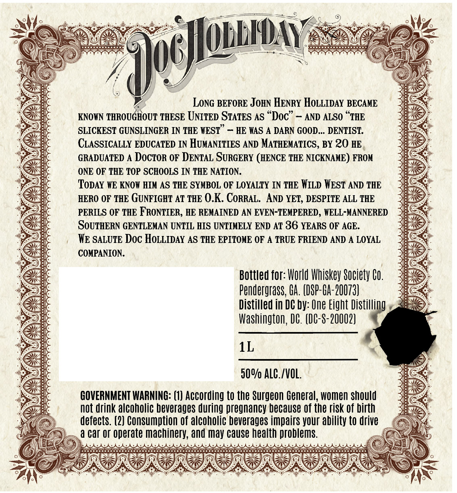
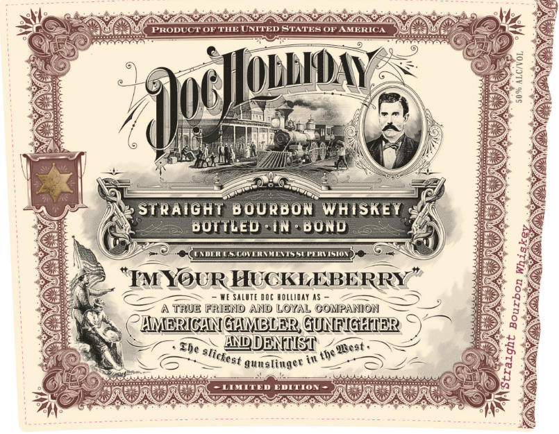

# TTB COLA Label Images - TTBID 26238001000190

**Brand Name:** DOC HOLLIDAY

**Issue Date:** 09/09/2026

**Origin Code:** 08

**Product Class/Type:** 111

**Source:** [TTB Public COLA Registry](https://ttbonline.gov/colasonline/viewColaDetails.do?action=publicFormDisplay&ttbid=26238001000190)

## Label Images

### Back Label

### Front Label

## Extracted Label Text

*Text extracted via OCR - may contain errors*

**Detected Age:** 36 Years

### Back Label

LONG BEFORE JoHN HENRY HOLLIDAY BECAME
KNOWN THROUGHOUT THESE UNITED STATES As "Doc"
AND ALSO
THE
SLICKEST GUNSLINGER IN THE WEST
HE WAS A DARN GOOD _ DENTIST:
CLASSICALLY EDUCATED IN HUMANITIES AND MATHEMATICS, BY 20 HE
GRADUATED
DOcTOR OF DENTAL SURGERY (HENCE THE NICKNAME) FROM
ONE OF THE TOP SCHOOLS IN THE NATION:
ToDAY WE KNOW HIM AS THE SYMBOL OF LOYALTY IN THE WILD WEST AND THE
HERO OF THE GUNFIGHT AT THE 0.K. CORRAL   AND YET; DESPITE ALL THE
PERILS OF THE FRONTIER; HE REMAINED AN EVEN-TEMPERED , WELL-MANNERED
SoUTHERN GENTLEMAN UNTIL HIS UNTIMELY END AT 36 YEARS OF AGE.
WE SALUTE Doc HoLLIDAY AS THE EPITOME OF A TRUE FRIEND AND A LOYAL
COMPANION:
Bottled for: World Whiskey Society Co.
Pendergrass;, Ga: (DSP-GA-20073}
Distilled in DC by: One Eight Distilling
Washington, DC. (C-S-20002)
1L
500/ ALC./VOL.
GOVERNMENT WARNING: (1) According to the Surgeon General, women should
not drink alcoholic beverages during pregnancy because Of the risk of birth
defects . (2) Consumption Of alcoholic beverages impairs your ability to drive
a car Or operate machinery; and may cause health problems
9oc]lqdbidav

### Front Label

PRODUCT OF THE UNITED STATES OF AMERICA
OLb#aY
1
8
STRAIGHT
B OURBON
WHISKEY
BOTTLED-IN
BOND
UwEn USGVEAIWCITSsupuVISON
TM YOURHUCKLEBERRY
WE SaLUTE Ooc holliay AS
TRUE FRIEND AND LOYAL COMPANION
HMERICANGHMBLER GUNFIGHIER
Ehe
ANDDENIST ,heuest:
gunslinger in
LTMTTED EDITION
1
1
slictest
