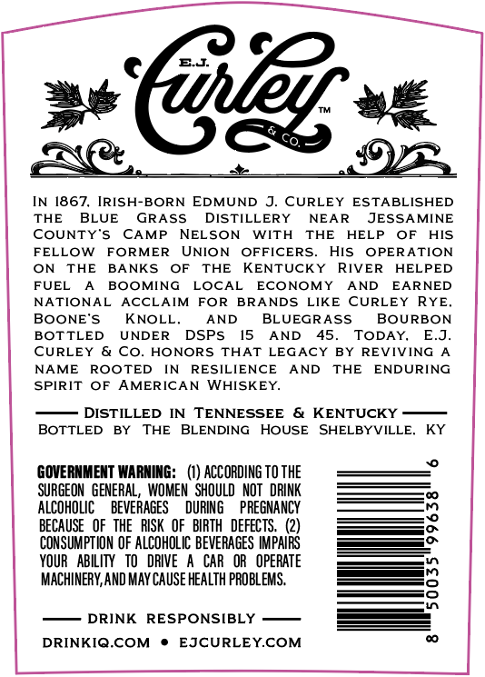
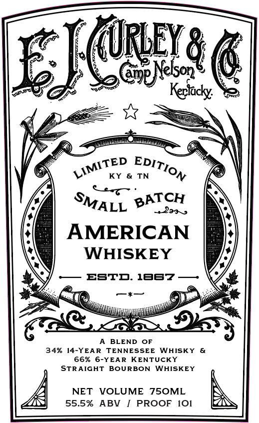

# TTB COLA Label Images - TTBID 26238001000202

**Brand Name:** E.J. CURLEY & CO.

**Issue Date:** 09/02/2026

**Origin Code:** 22

**Product Class/Type:** 140

**Source:** [TTB Public COLA Registry](https://ttbonline.gov/colasonline/viewColaDetails.do?action=publicFormDisplay&ttbid=26238001000202)

## Label Images

### Back Label

### Front Label

## Extracted Label Text

*Text extracted via OCR - may contain errors*

**Detected Proof:** 68

### Back Label

6%5
1867,
IRISH-BORN EDMUND
CURLEY
ESTABLISHED
THE
BLUE
GRASS
DISTILLERY
NEAR
JESSAMINE
COUNTY'S
CAMP
NELSON
WITH
THE
HELP
OF
HIS
FELLOW
FORMER
UNION
OFFICERS
His
OPERATION
ON
THE
BANKS
OF
THE
KENTUCKY
RIVER
HELPED
FUEL
BOOMING
LOCAL
ECONOMY
AND
EARNED
NATIONAL
ACCLAIM
FOR
BRANDS
LIKE
CURLEY
RYE
BOONE'S
KNOLL _
AND
BLUEGRASS
BOURBON
BOTTLED
UNDER
DSPS
15
AND
45 _
TODAY,
E.J_
CURLEY
Co_
HONORS
THAT LEGACY
BY
REVIVING
NAME
ROOTED
IN
RESILIENCE
AND
THE
ENDURING
SPIRIT
OF
AMERICAN
WHISKEY:
DISTILLED
IN TENNESSEE
& KENTUCKY
BOTTLED
BY
THE
BLENDING
HOUSE
SHELBYVILLE:
KY
GOVERNMENT WARNING:   (1) ACCORDING TO THE
SURGEON   GENERAL
WOMEN   SHOULD   NOT   DRINK
alcOhOLIc
BEVERAGES
DURING
PREGNANCY
~
BECAUSE   OF THE   RISK   OF   BIRTH   DEFECTS.
2
CONSUMPTION OF ALCOHOLIC BEVERAGES IMPAIRS
YOUR   ABILITY   To   DRIVE
CAR   OR   OPERATE
MACHINERY,AND MAY CAUSE HEALTH PROBLEMS.
3
DRINK RESPONSIBLY
DRINKIQ.COM
EJCURLEY.COM

### Front Label

EJC
Keridcky:
KY
TN
BATCH
Maa ,
AMERICAN
WHISKEY
ESTD: 1B67
BLEND
OF
34%
14-YEAR
TENNESSEE
WHISKY
66%
6-YEAR
KENTUCKY
STRAIGHT
BoURBON
WHISKEY
NET
VOLUME
75OML
55.5%
ABV
PROOF
IO1
@9882
EDITION
LIMITED
SMALL
