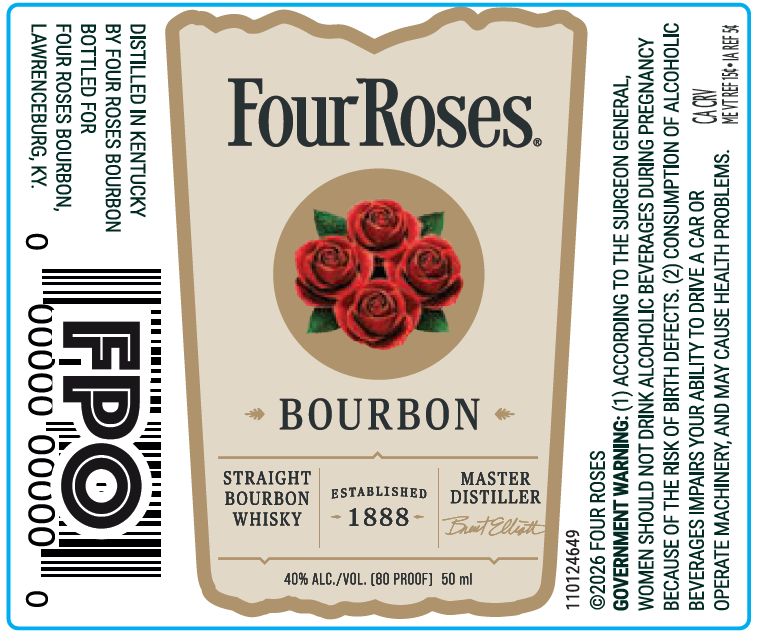

# TTB COLA Label Images - TTBID 26238001000338

**Brand Name:** FOUR ROSES

**Issue Date:** 09/02/2026

**Origin Code:** 01

**Product Class/Type:** 101

**Source:** [TTB Public COLA Registry](https://ttbonline.gov/colasonline/viewColaDetails.do?action=publicFormDisplay&ttbid=26238001000338)

## Label Images

### Front Label

## Extracted Label Text

*Text extracted via OCR - may contain errors*

**Detected Proof:** 80

### Front Label

SAUWHLEUU -gysygoud HITVSH 3SNVO AVN ONY ‘YSNIHOVW alvuado
MY) HO UVO V 3ARIG OL ALITISY UNDA SUVA SIOVUSATE
OMOHODTY 40 NOLLAWNSNOS (2) ’$193430 HIMIG JO ¥SI 3HL 40 3snvo3a
AONVNOSUd ONRING SI9VYIAIS OTIOHOTTY YNRIG LON CTNOHS NINOM
‘JWdJNJ9 NOJOUNS FHL OL ONIGHOIOV (1) -DNINUVM LNWNYIA0S
S3SOU UNOS 9Z0ZO

69PZLOLL

MASTER
DISTILLER

BOURBON
Sa,

40% ALC./VOL. (80 PROOF] 50 mi

WN
(<b)
S
p=
=
pe

STRAIGHT
BOURBON
WHISKY

DISTILLED IN KENTUCKY
BY FOUR ROSES BOURBON
BOTTLED FOR

FOUR ROSES BOURBON,
LAWRENCEBURG, KY. Q. 0000

=n
Wg

0000
