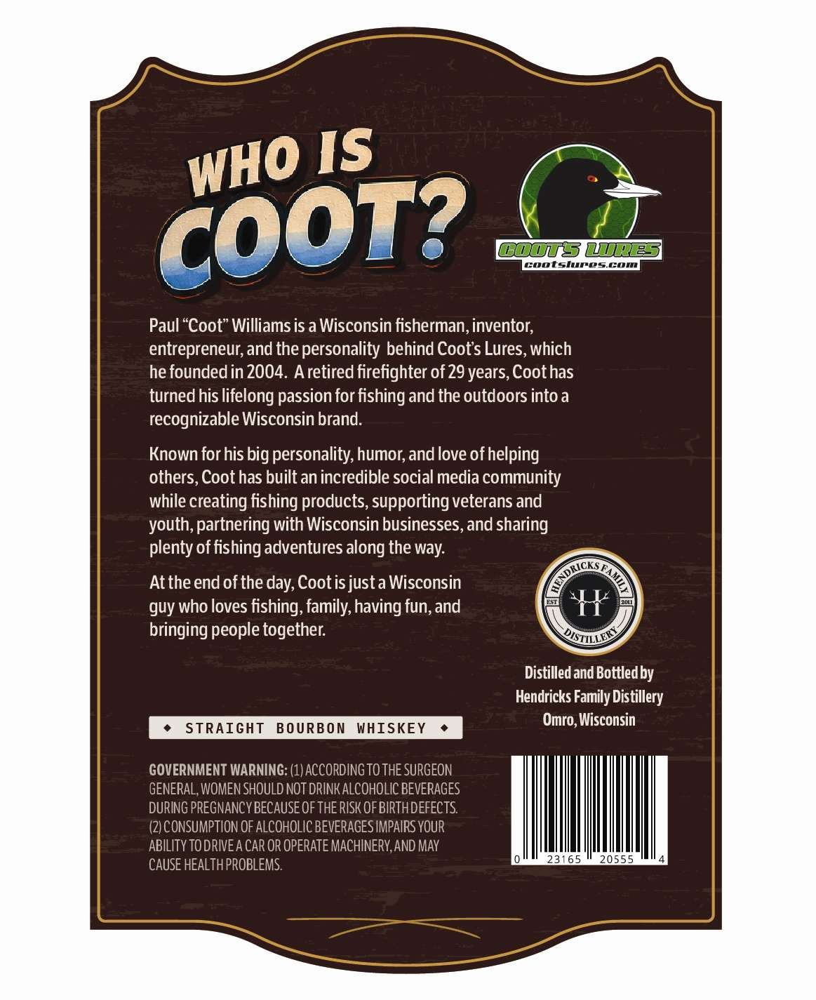
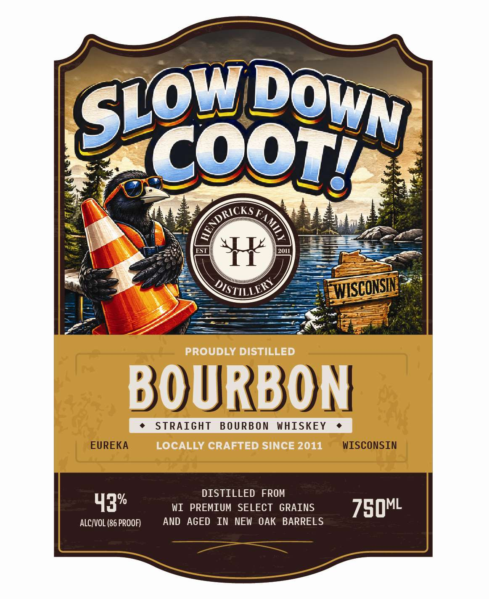

# TTB COLA Label Images - TTBID 26238001000341

**Brand Name:** SLOW DOWN COOT

**Issue Date:** 09/04/2026

**Origin Code:** 48

**Product Class/Type:** 101

**Source:** [TTB Public COLA Registry](https://ttbonline.gov/colasonline/viewColaDetails.do?action=publicFormDisplay&ttbid=26238001000341)

## Label Images

### Back Label

### Front Label

## Extracted Label Text

*Text extracted via OCR - may contain errors*

**Detected Proof:** 86
**Detected Age:** 29 Years

### Back Label

Paul “Coot” Williams is a Wisconsin fisherman, inventor,
entrepreneur, and the personality behind Coot's Lures, which
he founded in 2004. A retired firefighter of 29 years, Coot has
turned his lifelong passion for fishing and the outdoors into a
recognizable Wisconsin brand.

Known for his big personality, humor, and love of helping
others, Coot has built an incredible social media community

while creating fishing products, supporting veterans and
youth, partnering with Wisconsin businesses, and sharing
plenty of fishing adventures along the way.

At the end of the day, Cootis just a Wisconsin
guy who loves fishing, family, having fun, and
bringing people together.

Distilled and Bottled by
Hendricks Family Distillery

¢ STRAIGHT BOURBON WHISKEY « Omro, Wisconsin

GOVERNMENT WARNING: (1) ACCORDING TO THE SURGEON
GENERAL, WOMEN SHOULD NOT DRINK ALCOHOLIC BEVERAGES
DURING PREGNANCY BECAUSE OF THE RISK OF BIRTH DEFECTS.
(2) CONSUMPTION OF ALCOHOLIC BEVERAGES IMPAIRS YOUR
ABILITY TODRIVE A CAR OR OPERATE MACHINERY, AND MAY
CAUSE HEALTH PROBLEMS.

### Front Label

(518oo28|
1
EST
X
2011
DISTHLLZ
PROUDLY DISTILLED
BOURBON
STRAIGHT
B O URB O N
WHISKEY
EUREKA
LOCALLY CRAFTED SINCE 2011
WISCONSIN
DISTILLED FROM
43
WI PREMIUM SELECT GRAINS
750ML
ALCIVOL (86 PROOF)
AND   AGED  IN NEW  OAK BARRELS
RICKS
AMII
WISCONSIN
