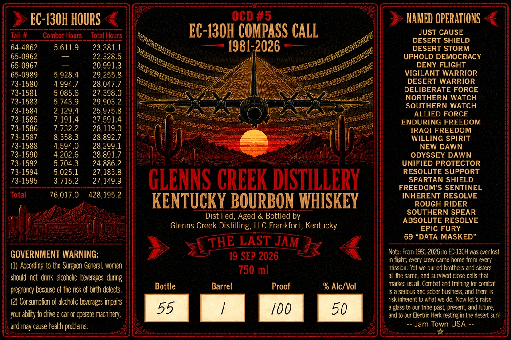

# TTB COLA Label Images - TTBID 26238001000370

**Brand Name:** GLENNS CREEK DISTILLERY

**Fanciful Name:** OCD #5

**Issue Date:** 09/09/2026

**Origin Code:** 22

**Product Class/Type:** 141

**Source:** [TTB Public COLA Registry](https://ttbonline.gov/colasonline/viewColaDetails.do?action=publicFormDisplay&ttbid=26238001000370)

## Label Images

### Label 1

## Extracted Label Text

*Text extracted via OCR - may contain errors*

### Label 1

EC-130H HOURS
OCD #5
NAMED OPERATIONS
Tail #
Combat Hours
Total Hours
EC-I3OH COMPASS CALL
JUST CAUSE
DESERT SHIELD
64-4862
5,611.9
23,381.1
1981.2026
DESERT STORM
65-0962
22,328.5
UPHOLD DEMOCRACY
65-0967
20,991.3
DENY FLIGHT
65-0989
5,928.4
29,255.8
VIGILANT WARRIOR
73-1580
4,994.7
28,047.7
DESERT WARRIOR
DELIBERATE FORCE
73-1581
5,085.6
27,398.0
NORTHERN WATCH
73-1583
5,743.9
29,903.2
SOUTHERN WATCH
73-1584
2,129.4
25,975.8
ALLIED FORCE
73-1585
7.191.4
27,591.4
ENDURING FREEDOM
73-1586
7.732.2
28,119.0
IRAQI FREEDOM
73-1587
8,358.3
28,892.7
WILLING SPIRIT
73-1588
4,594.0
28,299.1
NEW DAWN
73-1590
4,202.6
28,891.7
ODYSSEY DAWN
73-1592
5,704.3
24,886.2
UNIFIED PROTECTOR
73-1594
5,025.1
27,183.8
RESOLUTE SUPPORT
73-1595
3,715.2
27,149.9
GLENNS CRCEK DISTILLERY
SPARTAN SHIELD
FREEDOM'S SENTINEL
Total
76,017.0
428,195.2
INHERENT RESOLVE
KENTUCKY BOURBON WHISKEY
ROUGH RIDER
SOUTHERN SPEAR
Distilled, Aged & Bottled by
ABSOLUTE RESOLVE
Glenns Creek Distilling; LLC Frankfort; Kentucky
EPIC FURY
THE LAST JAM
69 "DATA MASKED"
GOVERNMENT WARNING:
Note: From 1981-2026 n EC 130H was ever lost
19 SEP 2026
flight; every crew came hore fror every
(4) According to the Surgeon General, women
750 ml
mission. Yet we buried brothers and sisters
should not  drink  alcoholc beverages during
all the same, and survived close calls that
Bottle
Barrel
Proof
% Alc/Vol
marked us all. Corbat and training for combat
pregnarcy because of the risk of birth defects.
serious and sober business; and there is
Consumption of alcoholic beverages impairs
risk inherent to what we do. Now let'
raise
55
100
50
glass t0 our tribe past, present; and future;
your ability to drive a car or operate machinery;
ard t0 our Electric Herk resting in the desert sunl
and may cause health problems:
Jam Town USA
