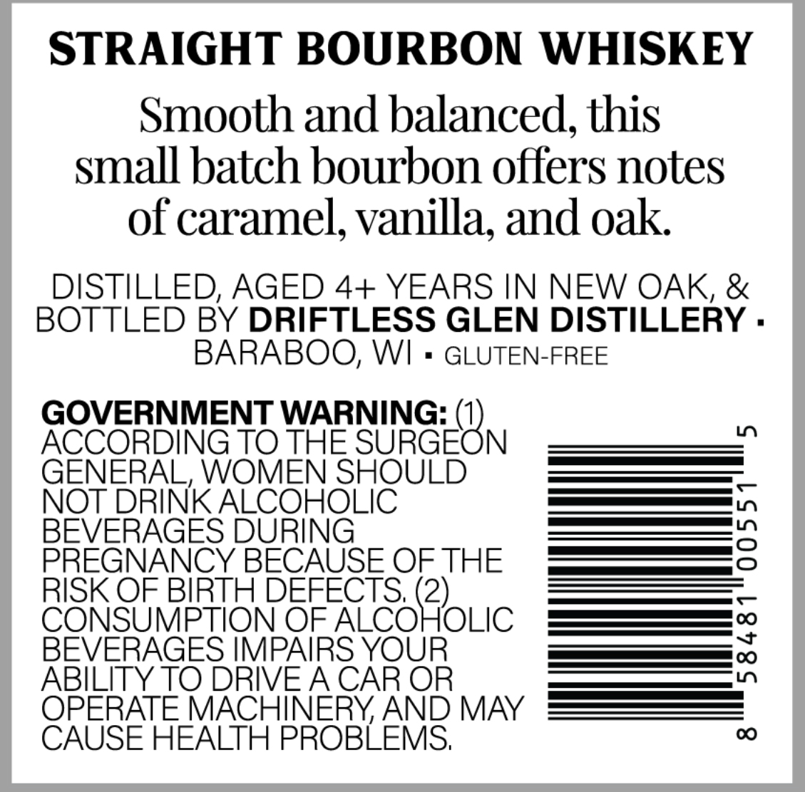
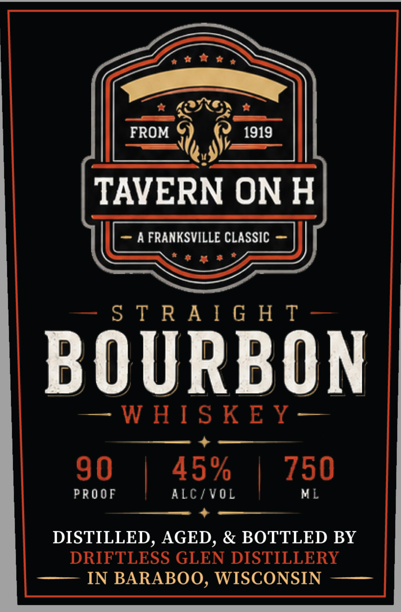

# TTB COLA Label Images - TTBID 26238001000426

**Brand Name:** TAVERN ON H

**Issue Date:** 09/03/2026

**Origin Code:** 48

**Product Class/Type:** 101

**Source:** [TTB Public COLA Registry](https://ttbonline.gov/colasonline/viewColaDetails.do?action=publicFormDisplay&ttbid=26238001000426)

## Label Images

### Back Label

### Front Label

## Extracted Label Text

*Text extracted via OCR - may contain errors*

**Detected Proof:** 90

### Back Label

STRAIGHT BOURBON WHISKEY
Smooth and balanced, this
small batch bourbon offers notes
of caramel; vanilla, and oak
DISTILLED, AGED 4+ YEARS IN NEW OAK, &
BOTTLED BY DRIFTLESS GLEN DISTILLERY .
BARABOO, WI
GLUTEN-FREE
GOVERNMENT WARNING:
1
ACcORDING TO THE SURGEON
GENERAL, WOMEN SHOULD
NOT DRINK ALCOHOLIC
BEVERAGES DURING
3
PREGNANCY BECAUSE OF THE
RISK OF BIRTH DEFECTS, (2)
CONSUMPTION OF ALCOHOLIC
BEVERAGES IMPAIRS YOUR
1
ABILITY TO DRIVEA CAR OR
OPERATE MACHINERYAND MAY
CAUSE HEALTH PROBLEMS;
00

### Front Label

ae Wey

& APNE &

FROM Ue 1919

TAVERN ON H

—- STRAIGHT —

BOURBON

—-WHISKEY—

+

90

45%

PROOF

|

ALC/VOL

730

+

DISTILLED, AGED, & BOTTLED BY

DRIFTLESS GLEN DISTILLERY

—— IN BARABOO, WISCONSIN ——
