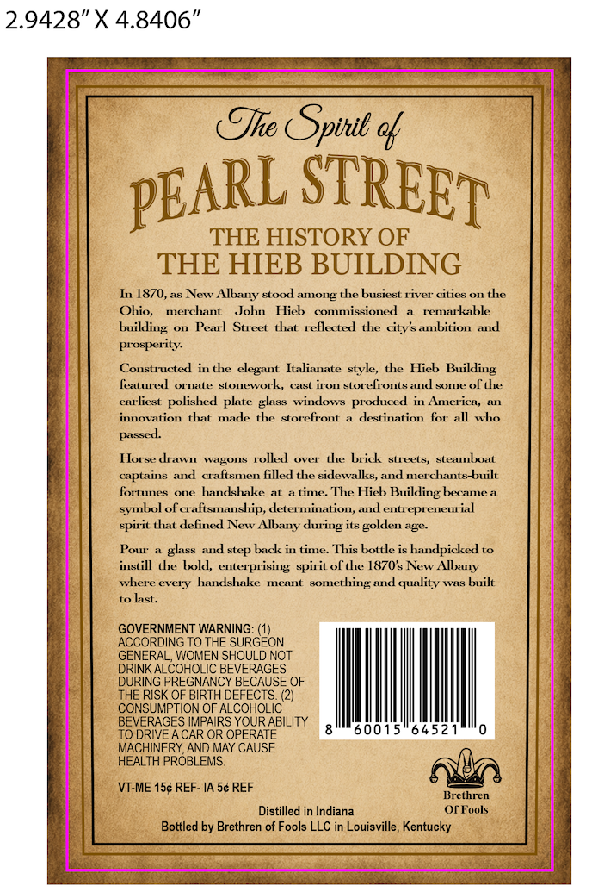
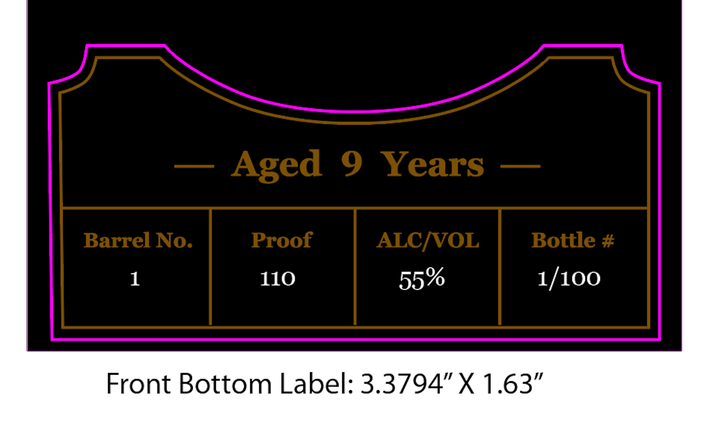

# TTB COLA Label Images - TTBID 26238001000573

**Brand Name:** PEARL STREET

**Issue Date:** 09/17/2026

**Origin Code:** 22

**Product Class/Type:** 141

**Source:** [TTB Public COLA Registry](https://ttbonline.gov/colasonline/viewColaDetails.do?action=publicFormDisplay&ttbid=26238001000573)

## Label Images

### Back Label

### Front Label

## Extracted Label Text

*Text extracted via OCR - may contain errors*

**Detected Proof:** 110
**Detected Age:** 9 Years

### Back Label

The Spinit a

ppARL STREED

THE HISTORY OF
THE HIEB BUILDING

In 1870, as New Albany stood among the busiest river cities on the
merchant John Hieb commissioned a remarkable
building on Pearl Street that reflected the city’sambition and
prosperity.
Constructed in the clegant Halianate style, the Hieb Building
featured ornate stonework, cast iron storefronts and some of the
earliest polished plate glass windows produced in America, an
innovation that made the storefront a destination for all who
passed.

Horse drawn wagons rolled over the brick streets, steamboat
captains and crafismen filled the sidewalks, and merchants-built
fortunes one handshake at a time. The Hieb Building became a
symbol of crafismanship, determination, and entrepreneurial
spirit that defined New Albany during its golden age.

Pour a glass and step back in time. This bottle is handpicked to
instill the bold, enterprising spirit of the 1870's New Albany
where every handshake meant something and quality was built
to last.

GOVERNMENT WARNING: (1)
ACCORDING TO THE SURGEON
GENERAL, WOMEN SHOULD NOT
DRINK ALCOHOLIC BEVERAGES
DURING PREGNANCY BECAUSE OF
THE RISK OF BIRTH DEFECTS. (2)
CONSUMPTION OF ALCOHOLIC
BEVERAGES IMPAIRS YOUR ABILITY
TO DRIVE ACAR OR OPERATE
MACHINERY, AND MAY CAUSE
HEALTH PROBLEMS.
\VI-ME 15¢ REF- IA 5¢ REF toa
Distilled in Indiana OF Fools
Bottled by Brethren of Fools LLC in Louisville, Kentucky

### Front Label

Aged
9
Years
Barrel No.
Proof
ALCNVOL
Bottle #
1
110
1/100
Front Bottom Label: 3.3794" X 1.63"
55%
