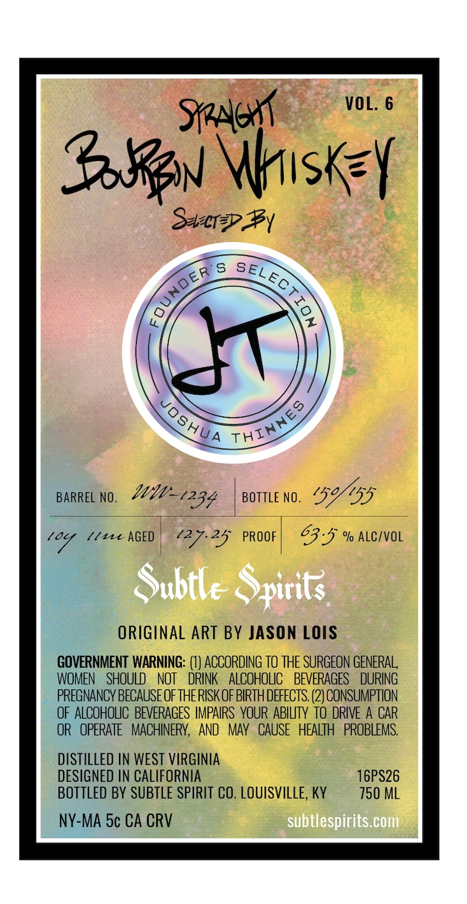
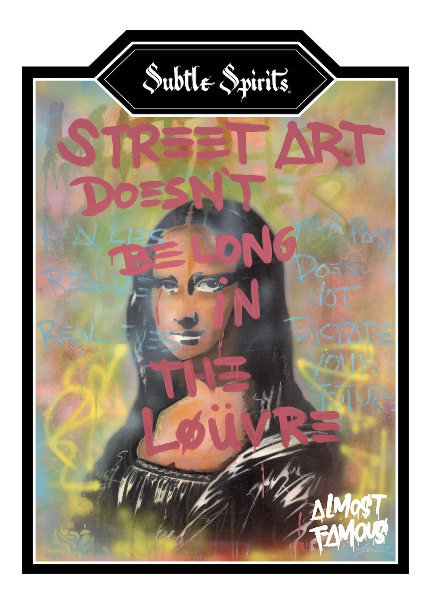

# TTB COLA Label Images - TTBID 26238001000580

**Brand Name:** SUBTLE SPIRITS

**Issue Date:** 09/02/2026

**Origin Code:** 22

**Product Class/Type:** 101

**Source:** [TTB Public COLA Registry](https://ttbonline.gov/colasonline/viewColaDetails.do?action=publicFormDisplay&ttbid=26238001000580)

## Label Images

### Back Label

### Front Label

## Extracted Label Text

*Text extracted via OCR - may contain errors*

**Detected Proof:** 127.2

### Back Label

VOL. 6
SAGw
S8zN Wisky
Scr>2y
BARREL NO.
BOTTLE NO.
'59/155
104
ll4 AGED
127.25
PROOF
63.5 % ALCIVOL
Subtle Spirits
ORIGINAL ART BY JASON LOIS
GOVERNMENT WARNING: (0) ACCORDING TO THE SURGEON GENERAL
WOMEN   SHOULD
NOT
DRINK   ALCOHOLIC
BEVERAGES
DURING
PREGNANCY BECAUSE OFTHERISK OF BIRTH DEFECTS; (2) CONSUMPTION
OF ALCOHOLIC   BEVERAGES IMPAIRS  YOUR ABILTY TO DRIVE A CAR
OR   OPERATE   MACHINERY,  AND
Mav   CAUSE   HEALTH   PROBLEMS:
DISTILLED IN WEST VIRGINIA
DESIGNED IN CALIFORNIA
16PS26
BOTTLED BY SUBTLE SPIRIT CO. LOUISVILLE, KY
750 ML
NY-MA 5c CA CRV
subtlespirits com
OUNDER &
GeLectiON
Jo8hUA
THINNES
WW-1234

### Front Label

Subtle Spirit:
STREFTART
DOESNT
FFAEL
J '
[os'
n
Mo
Pel
Tia
Von <
M
Livr=
AlMoST
TAMaI
TElong  ^
Je
Tn=
