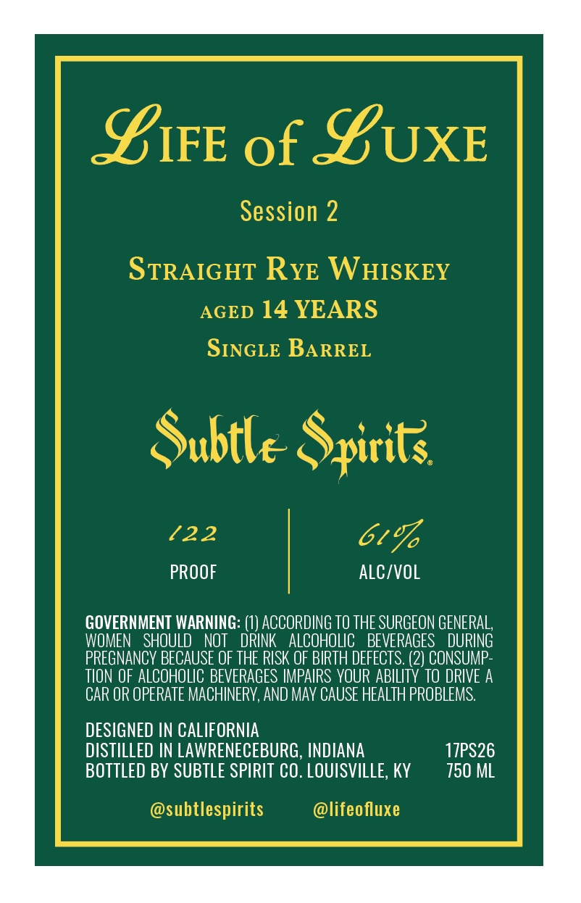
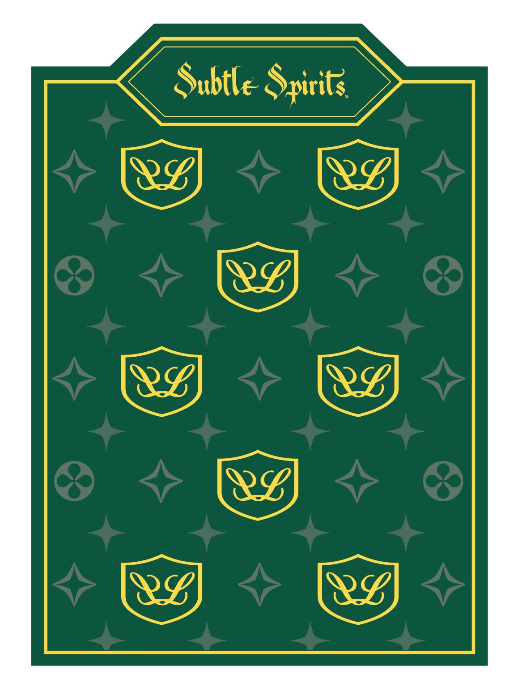

# TTB COLA Label Images - TTBID 26238001000585

**Brand Name:** SUBTLE SPIRITS

**Issue Date:** 09/02/2026

**Origin Code:** 22

**Product Class/Type:** 102

**Source:** [TTB Public COLA Registry](https://ttbonline.gov/colasonline/viewColaDetails.do?action=publicFormDisplay&ttbid=26238001000585)

## Label Images

### Back Label

### Front Label

## Extracted Label Text

*Text extracted via OCR - may contain errors*

*1 image(s) excluded: text did not meet readability threshold*

**Detected Proof:** 122
**Detected Age:** 14 Years

### Back Label

SIFE of SUXE
Session 2
STRAIGHT RYE WHISKEY
AGED 14 YEARS
SINGLE BARREL
Subtle Spirits
122
61%
PROOF
ALC/VOL
GOVERNMENT WARNING: (1) ACCORDING To THE SURGEON GENERAL,
WOMEN
SHOULD
NOT
DRINK
ALCOHOLIC   BEVERAGES
DURING
PREGNANCV BECAUSE OF THE RISK OF BIRTH DEFECTS. (2) CONSUMP_
TION OF ALCOHOLIC BEVERAGES IMPAIPS VOUR ABILITY To DRIVE A
CAR OR OPERATE MACHINERV, AND May CAUSE HEALTH PROBLEMS.
DESIGNED IN CALIFORNIA
DISTILLED IN LAWRENECEBURG, INDIANA
17PS26
BOTTLED BY SUBTLE SPIRIT CO. LOUISVILLE, KY
750 ML
@subtlespirits
@lifeofluxe
