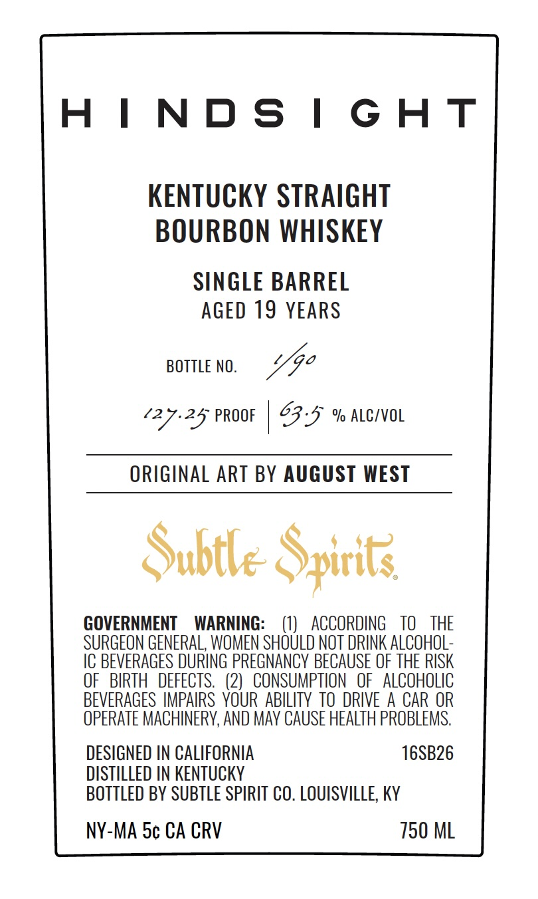
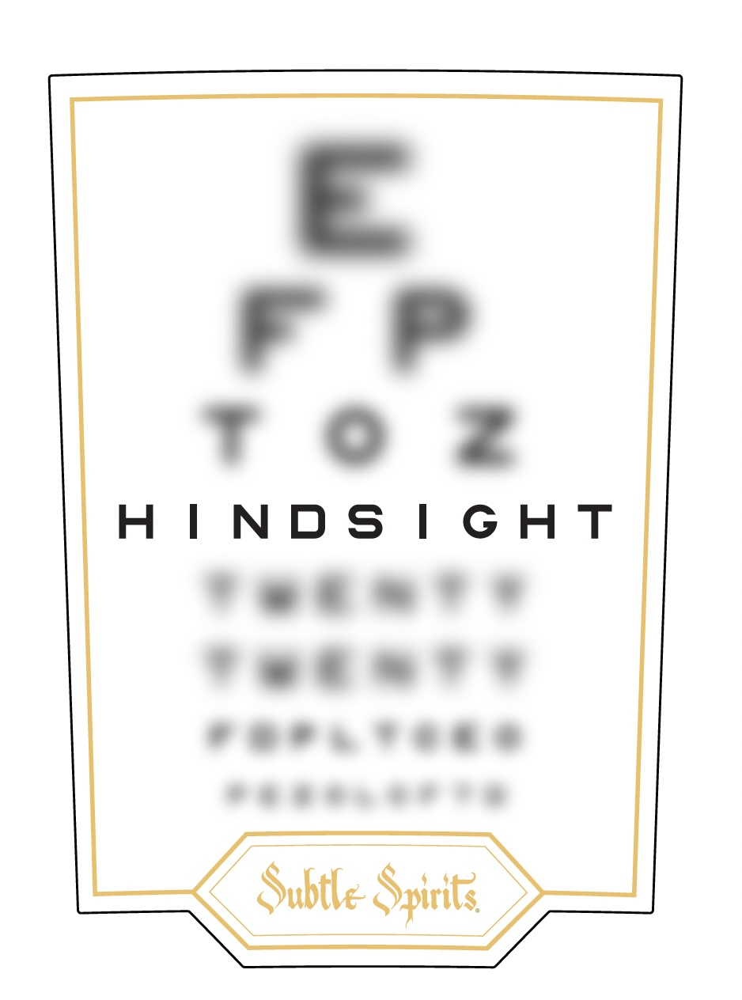

# TTB COLA Label Images - TTBID 26238001000587

**Brand Name:** SUBTLE SPIRITS

**Issue Date:** 09/03/2026

**Origin Code:** 22

**Product Class/Type:** 101

**Source:** [TTB Public COLA Registry](https://ttbonline.gov/colasonline/viewColaDetails.do?action=publicFormDisplay&ttbid=26238001000587)

## Label Images

### Back Label

### Front Label

## Extracted Label Text

*Text extracted via OCR - may contain errors*

*1 image(s) excluded: text did not meet readability threshold*

**Detected Age:** 19 Years

### Back Label

HINDSIGHT

KENTUCKY STRAIGHT
BOURBON WHISKEY

SINGLE BARREL
AGED 19 YEARS

BOTTLE NO. ea

‘27-25 PROOF | 23-5 % ALCIVOL

ORIGINAL ART BY AUGUST WEST

Subtle Spirits

GOVERNMENT WARNING: (1) ACCORDING TO THE
SURGEON GENERAL, WOMEN SHOULD NOT DRINK ALCOHOL-
IC BEVERAGES DURING PREGNANCY BECAUSE OF THE RISK
OF BIRTH DEFECTS. (2) CONSUMPTION OF ALCOHOLIC
BEVERAGES IMPAIRS YOUR ABILITY TO DRIVE A CAR OR
OPERATE MACHINERY, AND MAY CAUSE HEALTH PROBLEMS.

DESIGNED IN CALIFORNIA 16SB26
DISTILLED IN KENTUCKY
BOTTLED BY SUBTLE SPIRIT CO. LOUISVILLE, KY

NY-MA 5¢ CA CRV 7150 ML
