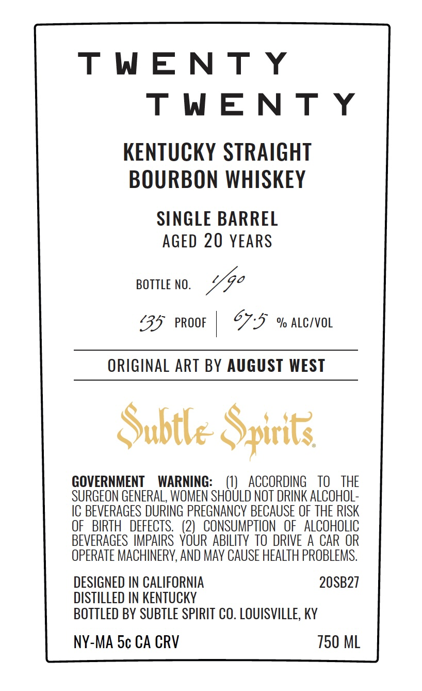
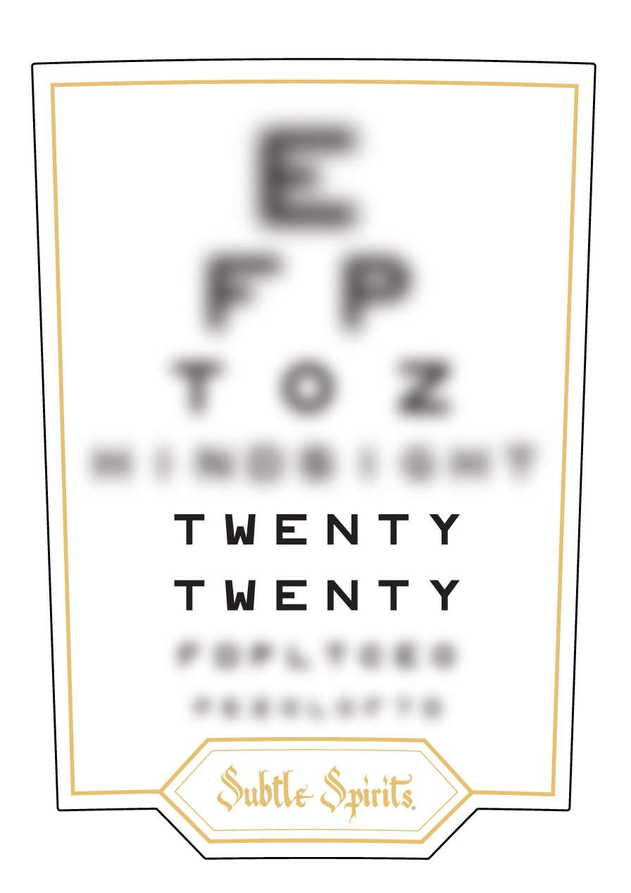

# TTB COLA Label Images - TTBID 26238001000590

**Brand Name:** SUBTLE SPIRITS

**Issue Date:** 09/03/2026

**Origin Code:** 22

**Product Class/Type:** 101

**Source:** [TTB Public COLA Registry](https://ttbonline.gov/colasonline/viewColaDetails.do?action=publicFormDisplay&ttbid=26238001000590)

## Label Images

### Back Label

### Front Label

## Extracted Label Text

*Text extracted via OCR - may contain errors*

*1 image(s) excluded: text did not meet readability threshold*

**Detected Age:** 20 Years

### Back Label

TWENT Y

TWENT Y

KENTUCKY STRAIGHT

BOURBON WHISKEY

SINGLE BARREL

AGED 20 YEARS

BOTTLE NO

Ye

‘35° PROOF | O75 % ALciVvoL

ORIGINAL ART BY AUGUST WEST

Subtle Spirits

GOVERNMENT WARNING:

(1) ACCORDING TO THE

SURGEON GENERAL, WOMEN SHOULD NOT DRINK ALCOHOL

IC BEVERAGES DURING PREGNANCY BECAUSE OF THE RISK

BEVERAGES IMPAIRS YOUR ABILITY TO DRIVE A CAR OR

OF BIRTH DEFECTS. (2) CONSUMPTION OF ALCOHOLIC

OPERATE MACHINERY, AND MAY CAUSE HEALTH PROBLEMS.

DESIGNED IN CALIFORNIA

20SB27

DISTILLED IN KENTUCKY

BOTTLED BY SUBTLE SPIRIT CO. LOUISVILLE, KY

NY-MA 5¢ CA CRV

750 ML
