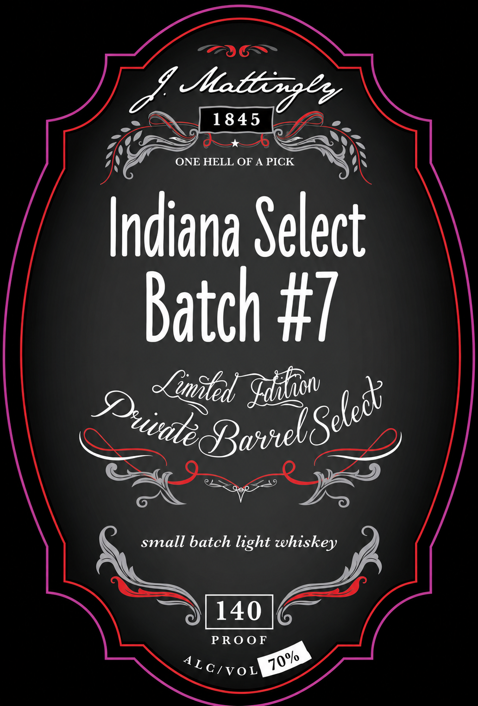
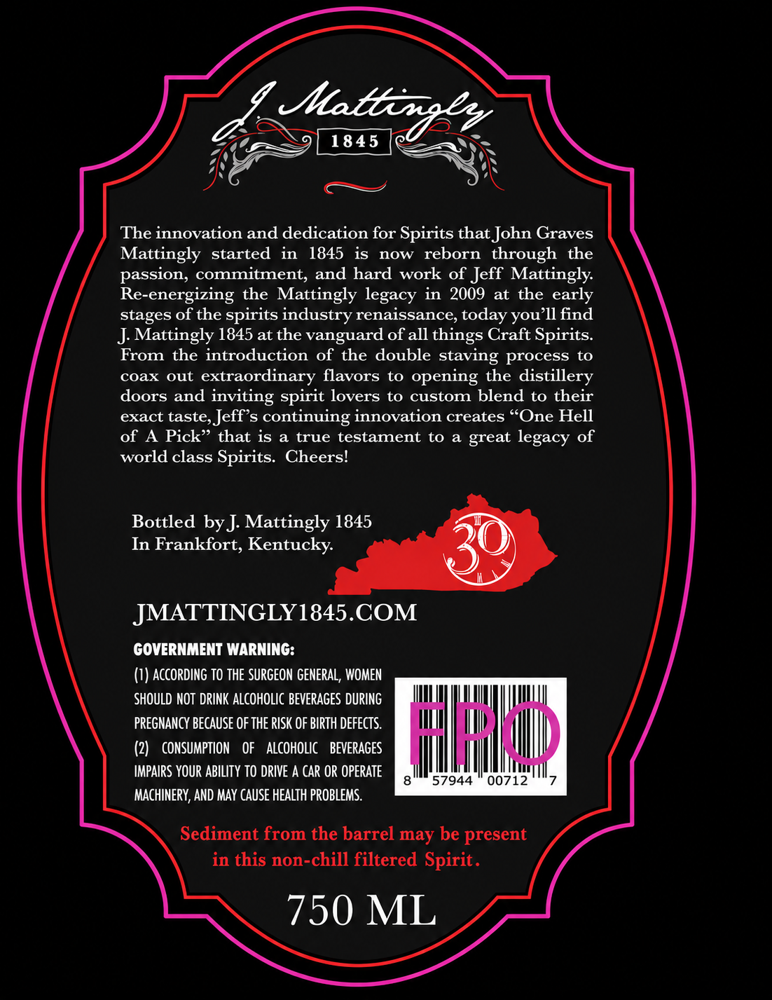

# TTB COLA Label Images - TTBID 26238001000630

**Brand Name:** J.MATTINGLY1845

**Fanciful Name:** INDIANA BATCH SELECT 7

**Issue Date:** 09/14/2026

**Origin Code:** 22

**Product Class/Type:** 144

**Source:** [TTB Public COLA Registry](https://ttbonline.gov/colasonline/viewColaDetails.do?action=publicFormDisplay&ttbid=26238001000630)

## Label Images

### Label 1

### Label 2

## Extracted Label Text

*Text extracted via OCR - may contain errors*

**Detected Proof:** 140

### Label 1

Jtattiney
1845
ONE HELL OF A PICK
Indiana Select
Batch #7
Ximled
small batch light rhiskey
140
PRO 0 F
Sditaowv
Ravwel Seled}
Dulec
70%
ALC/VO L

### Label 2

Mathaeo
1845
The innovation and dedication for Spirits that John Graves
Mattingly started
in
1845 is
now
reborn through
the
passion, commitment, and hard work of Jeff Mattingly
Re-energizing the Mattingly
in 2009 at the early
stages of the spirits industry renaissance;
you ]l find
J Mattingly 1845 at the vanguard of all
Craft Spirits:
From the introduction of the double staving process to
coax out
extraordinary flavors to opening the distillery
doors and
inviting
lovers to custom blend to their
exact taste, Jeff"s continuing innovation creates "One Hell
of
A Pick" that is
a true testament to a great
of
world class Spirits:
Cheers!
Bottled by J Mattingly 1845
In Frankfort; Kentucky:
JMATTINGLY1845.COM
GOVERNMENT WARNING:
(1) AccoRdInG TO THE SURGEON GENERAL , WOMEN
SHOULD NOT DRINK ALCOHOLIC BEVERAGES DURING
PREGNANCY BECAUSE OF THE RISK OF BIRTH DEFECTS.
(2)
CONSUMPTION
OF
alcohOLIC
BEVERAGES
Hudd
IMPAIRS YOUR ABILITY TO DRIVE A Car OR OPERATE
57944
00712
MACHINERY, AND MAY CAUSE HEALTH PROBLEMS.
Sediment from the barrel may be present
in this non-chill filtered Spirit .
750 ML
legacy
today
things
spirit
legacy
