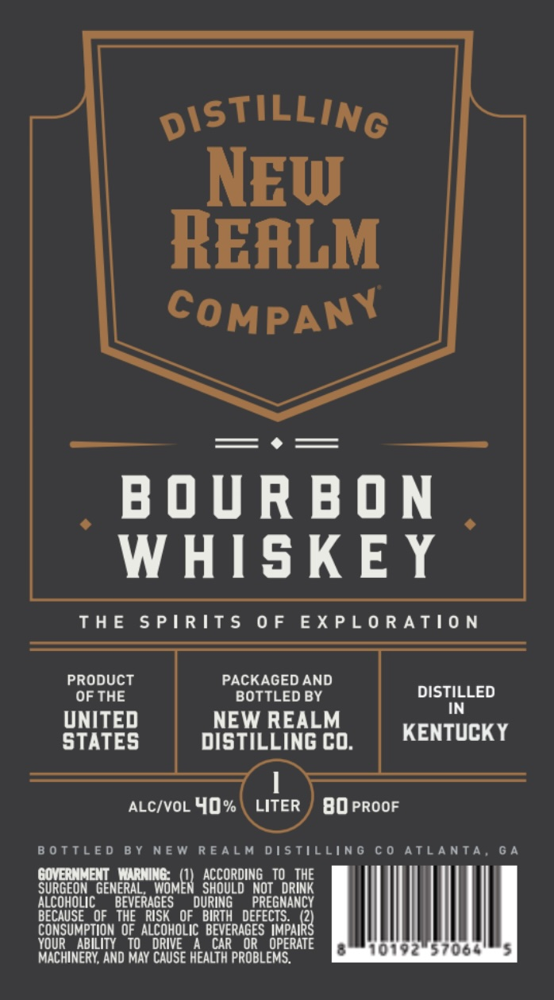

# TTB COLA Label Images - TTBID 26239001000046

**Brand Name:** NEW REALM DISTILLING COMPANY

**Issue Date:** 09/08/2026

**Origin Code:** 08

**Product Class/Type:** 141

**Source:** [TTB Public COLA Registry](https://ttbonline.gov/colasonline/viewColaDetails.do?action=publicFormDisplay&ttbid=26239001000046)

## Label Images

### Label 1

## Extracted Label Text

*Text extracted via OCR - may contain errors*

**Detected Proof:** 80

### Label 1

DiStiLLING
NEW
REALM
COMPANY
B 0 U R B O N
WHISKE Y
ThE
5 P | R IT $
0 F
EXPL 0 R AT0 N
PRODUCT
PACKAGED AND
OF THE
BOTTLED BY
DISTILLED
IN
UNITED
NEW REALM
STATES
DiSTILLING CO:
KENTUCK Y
ALCIVOL 40%
LITER
80 PROOF
B 0 TTLE D
B Y NEw R EALM DISTilLiNG
C 0
AtLAnTA,
6 4
COVERNMENT  WARNiNe:
ACCORDING _ TO   THE
SURGEON   GENERAL
MfomEH  seoordingoitourIhe
alcohOLIC
BEVERAGES
DURING
PREGMANCY
BECAUSE   OF   THE   RISK   OF   BIRTH   DEFECTS:
CONSUMPTION  OF  ALCOHOLIC   BEVERAGES  IMPAIRS
YOUR   ABILITY   TO
DRIVE
CAR
OR
OPERATE
10192"57064
MACHINERY, AND MAY CAUSE HEALTH PROBLEMS.
