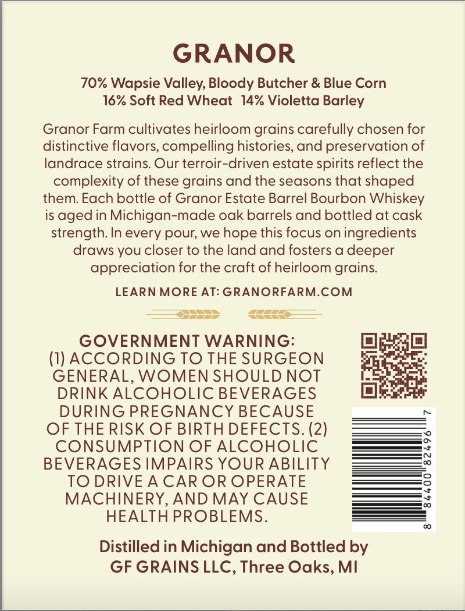
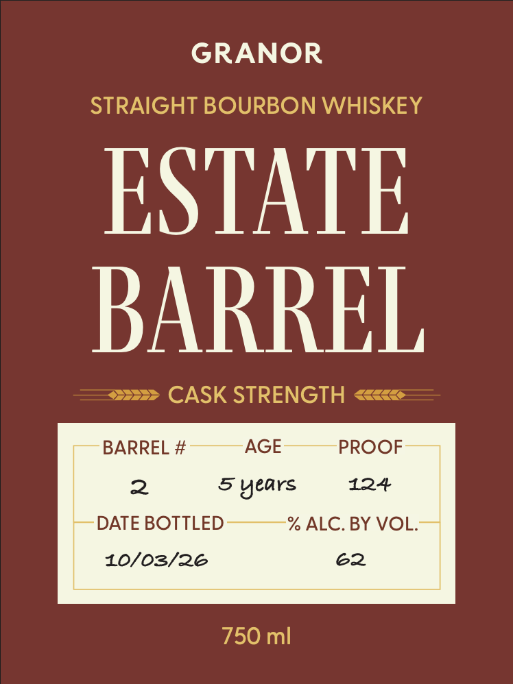

# TTB COLA Label Images - TTBID 26239001000085

**Brand Name:** GRANOR

**Fanciful Name:** ESTATE BARREL STRAIGHT BOURBON WHISKEY

**Issue Date:** 09/10/2026

**Origin Code:** 06

**Product Class/Type:** 101

**Source:** [TTB Public COLA Registry](https://ttbonline.gov/colasonline/viewColaDetails.do?action=publicFormDisplay&ttbid=26239001000085)

## Label Images

### Back Label

### Front Label

## Extracted Label Text

*Text extracted via OCR - may contain errors*

**Detected Age:** 5 Years

### Back Label

GRANOR
70% Wapsie Valley, Bloody Butcher & Blue Corn
16% Soft Red Wheat
14% Violetta Barley
Granor Farm cultivates heirloom grains carefully chosen for
distinctive flavors; compelling histories, and preservation of
landrace strains. Our terroir-driven estate spirits reflect the
complexity of these grains and the seasons that shaped
them Each bottle of Granor Estate Barrel Bourbon Whiskey
is aged in Michigan-made oak barrels and bottled at cask
strength: In every pour; we hope this focus on ingredients
draws you closer to the land and fosters a deeper
appreciation for the craft of heirloom grains.
LEARN MORE AT: GRANORFARM.COM
GOVERNMENT WARNING:
(I) AccORDING TO THE SURGEON
GENERAL, WOMEN SHOULD NOT
DRINK ALCOHOLIC BEVERAGES
DURING PREGNANCY BECAUSE
OF THE RISK OF BIRTH DEFECTS. (2)
CONSUMPTION OF ALCOHOLIC
BEVERAGES IMPAIRS YOUR ABILITY
w
TO DRIVE A CAR OR OPERATE
3
MACHINERY, AND MAY CAUSE
HEALTH PROBLEMS.
Distilled in Michigan and Bottled by
GF GRAINS LLC, Three Oaks, MI

### Front Label

GRANOR
STRAIGHT BOURBON WHISKEY
ESTATF
BARREL
CASK STRENGTH
BARREL #
AGE
PROOF
2
5 years
124
DATE BOTTLED
% ALC.BY VOL:
10/03/26
62
750 ml
