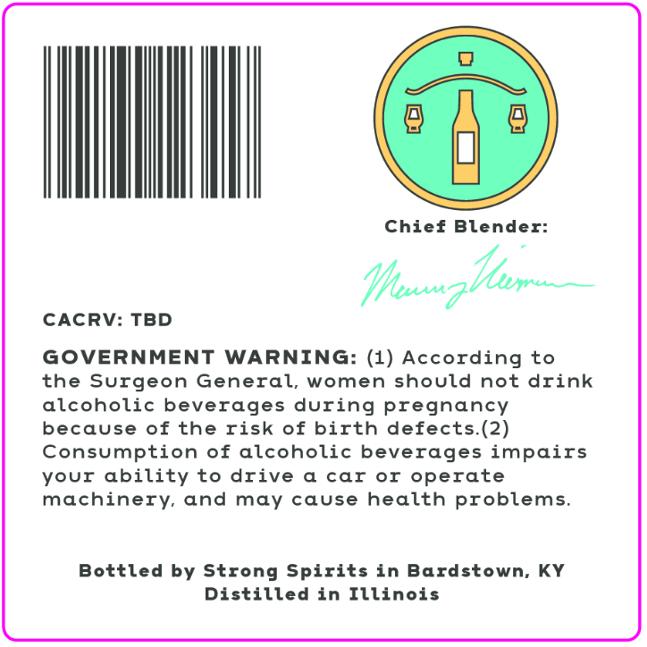
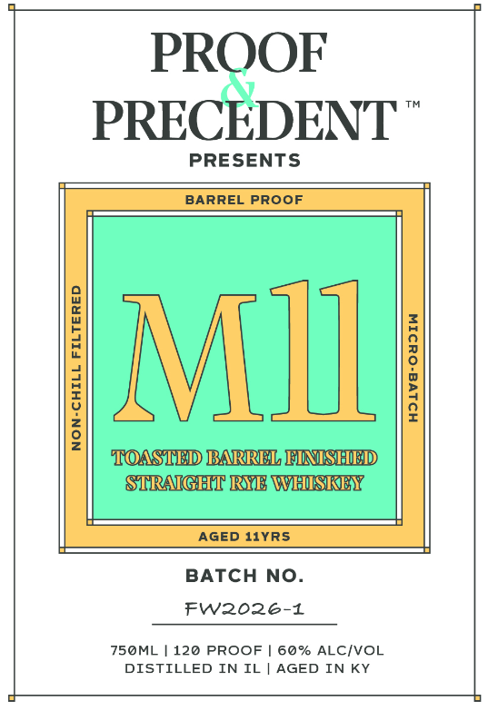
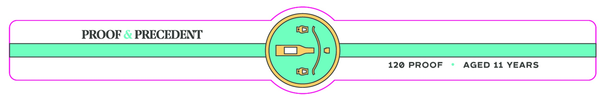

# TTB COLA Label Images - TTBID 26239001000149

**Brand Name:** PROOF & PRECEDENT

**Fanciful Name:** M11

**Issue Date:** 09/02/2026

**Origin Code:** 22

**Product Class/Type:** 102

**Source:** [TTB Public COLA Registry](https://ttbonline.gov/colasonline/viewColaDetails.do?action=publicFormDisplay&ttbid=26239001000149)

## Label Images

### Back Label

### Front Label

### Label 3

## Extracted Label Text

*Text extracted via OCR - may contain errors*

**Detected Proof:** 120
**Detected Age:** 11 Years

### Back Label

Chief Blender:
CACRV: TBD
GOVERNMENT
WARNING: (1) According to
the Surgeon General, women should not drink
alcoholic beverages during pregnancy
because of the risk of birth defects.(2)
Consumption of alcoholic beverages impairs
Your ability to drive
car
or operate
machinery and may cause
health problems.
Bottled by Strong Spirits in Bardstown: KY
Distilled in Illinois
Hhuezthr

### Front Label

PROOF
PRECEDENT
PRESENTS
BARREL PROOF
1
NJUL
7
1
1
TOASTED BARREL FIATSHDD
STRAIGHT RYE WHISREY
AGED 11YRS
BATCH No
Fw2026-1
750ML
120 PROOF
60% ALCIVOL
DISTILLED IN IL
AGED IN KY

### Label 3

PROOF & PRECEDENT
120 PROOF
AGED 11
YEARS
