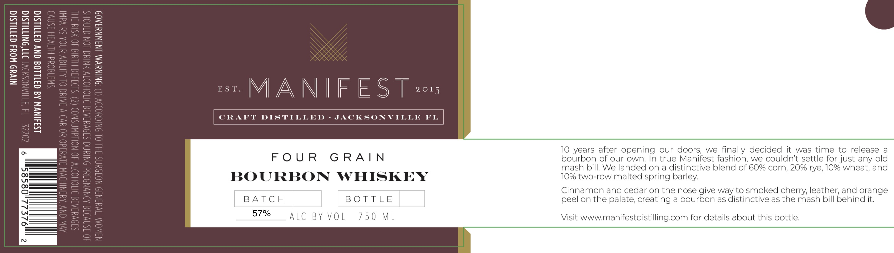

# TTB COLA Label Images - TTBID 26239001000213

**Brand Name:** MANIFEST

**Issue Date:** 09/25/2026

**Origin Code:** 16

**Product Class/Type:** 141

**Source:** [TTB Public COLA Registry](https://ttbonline.gov/colasonline/viewColaDetails.do?action=publicFormDisplay&ttbid=26239001000213)

## Label Images

### Label 1

## Extracted Label Text

*Text extracted via OCR - may contain errors*

**Detected Proof:** 114
**Detected Age:** 10 Years

### Label 1

est MANIFEST 2

Cr

Dd

ACK

KI

FOUR GRAIN

10 years after opening our doors, we finally decided it was time to release a

bourbon of our own. In true Manifest fashion, we couldn't settle for just any old

mash bill. We landed on a distinctive blend of 60% corn, 20% rye, 10% wheat, and

BOURBON WHISKEY

10% two-row malted spring barley.

Cinnamon and cedar on the nose give way to smoked cherry, leather, and orange

BATCH

BOTTLE

peel on the palate, creating a bourbon as distinctive as the mash bill behind it.

57%

ALC BY VOL

750 ML

Visit www.manifestdistilling.com for details about this bottle.
