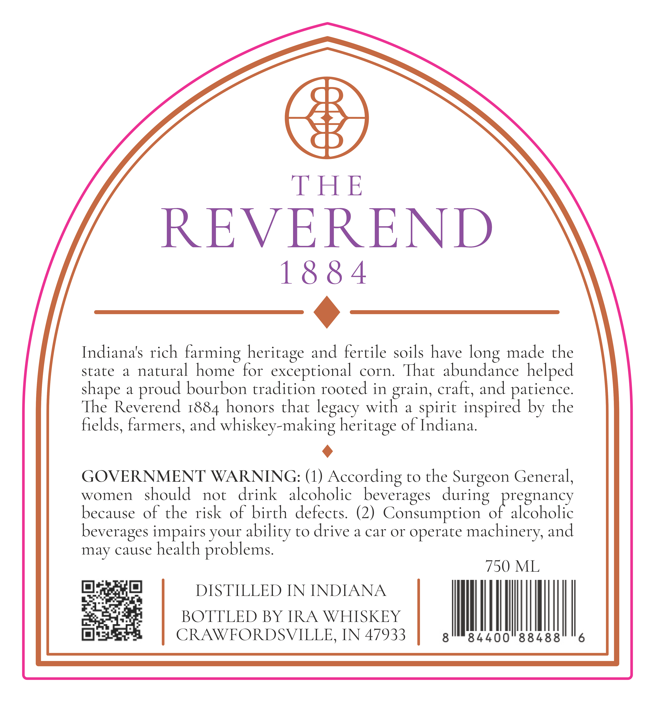
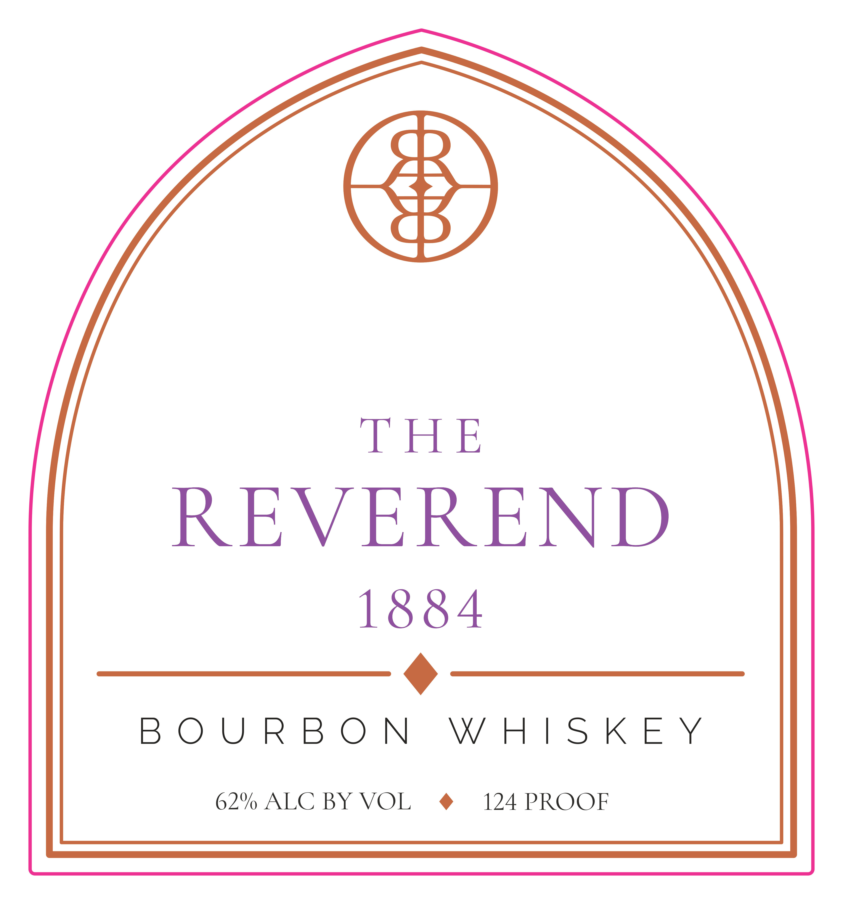

# TTB COLA Label Images - TTBID 26239001000293

**Brand Name:** THE REVEREND 1884

**Issue Date:** 09/02/2026

**Origin Code:** 19

**Product Class/Type:** 141

**Source:** [TTB Public COLA Registry](https://ttbonline.gov/colasonline/viewColaDetails.do?action=publicFormDisplay&ttbid=26239001000293)

## Label Images

### Back Label

### Front Label

### Label 3

## Extracted Label Text

*Text extracted via OCR - may contain errors*

*1 image(s) excluded: text did not meet readability threshold*

**Detected Proof:** 124

### Back Label

THE
REVEREND
18 8 4
Indiana's rich
farming heritage and fertile soils have
made the
state
a
natural home for exceptional corn:
That  abundance helped
a
bourbon tradition rooted in grain, craft, and patience:
The Reverend 1884 honors that
with
a
inspired by the
fields, farmers; and whiskey-making heritage of Indiana
GOVERNMENT WARNING: (1)
According to the Surgeon General,
women
should
not
drink
alcoholic   beverages   during   pregnancy
because of the risk of birth defects  (2) Consumption of alcoholic
beverages impairs your ability to drive a car or operate machinery;
may cause health
problems:
750 ML
DISTILLED IN INDIANA
BOTTLED BY IRA WHISKEY
CRAWFORDSVILLE
IN 47933
84400
88488
long
shape
proud
legacy
spirit
and

### Front Label

8)

THE

REVEREND

1884

a

BOURBON WHISKEY

62% ALC BY VOL ® 124 PROOF
