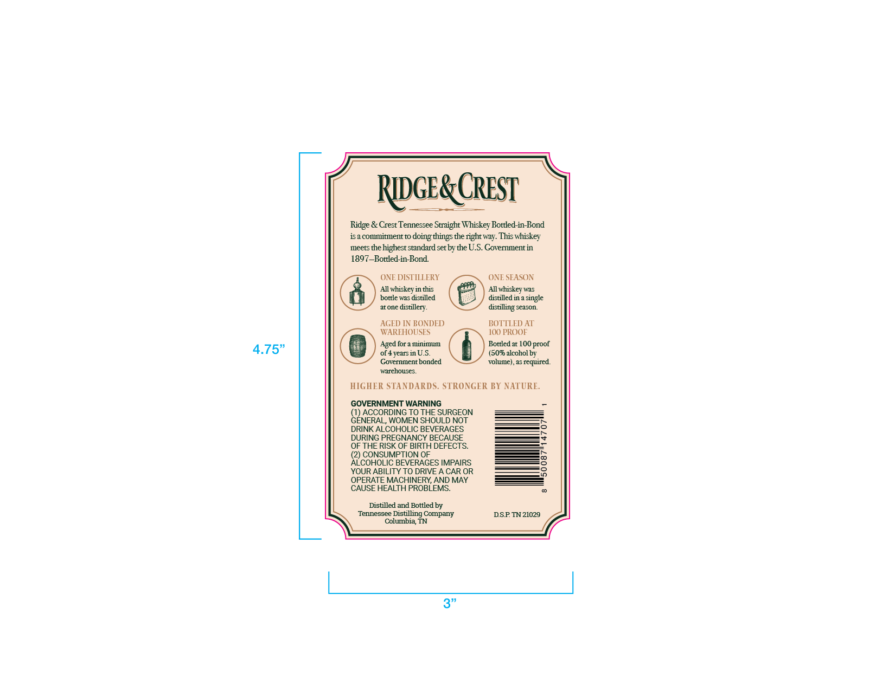
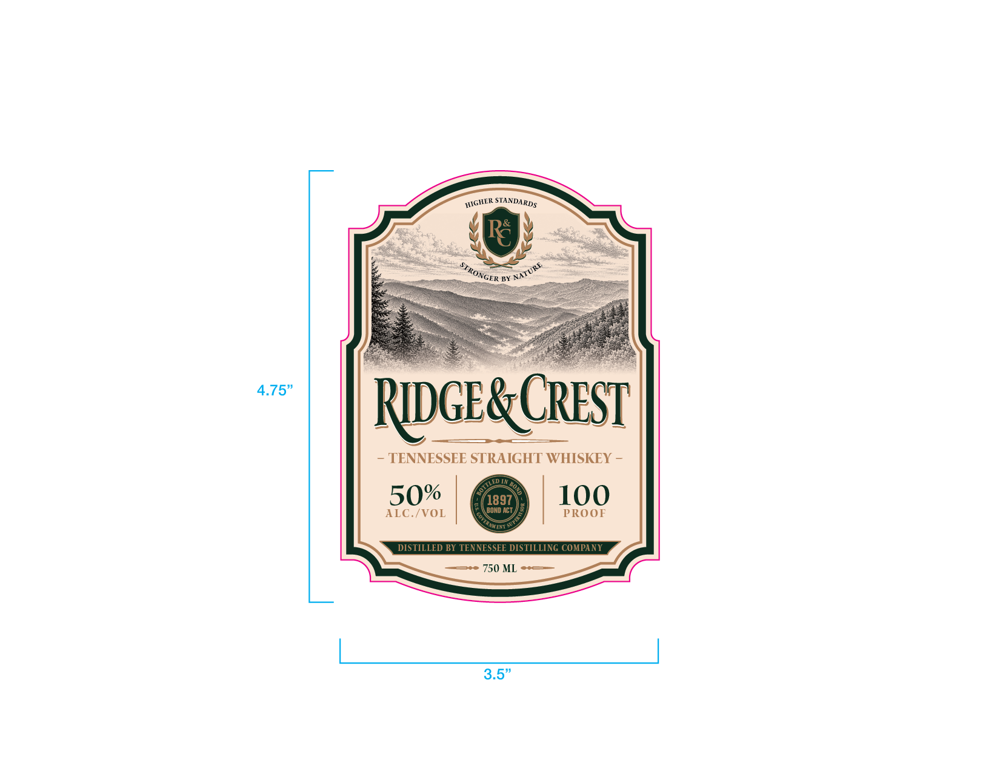

# TTB COLA Label Images - TTBID 26239001000330

**Brand Name:** RIDGE & CREST

**Issue Date:** 09/09/2026

**Origin Code:** 43

**Product Class/Type:** 119

**Source:** [TTB Public COLA Registry](https://ttbonline.gov/colasonline/viewColaDetails.do?action=publicFormDisplay&ttbid=26239001000330)

## Label Images

### Back Label

### Front Label

## Extracted Label Text

*Text extracted via OCR - may contain errors*

**Detected Proof:** 100
**Detected Age:** 4 Years

### Back Label

RlGE& CREST
Ridge & Crest Tennessee Straight Whiskey Bottled-in-Bond
is a COnmlitment tO doing -
the right way. This whiskey
meets thehighest standard set by the U.S. Covernment in
1897-Bottled-in-Bond
ONE DISTILLERY
ONE SEASON
All whiskey in this
All whiskey was
bottle ws distilled
distilled in 1 single
at one
distillery:
distilling season
AGED IN BONDED
BOTTLED AT
WAREHOUSES
IOO PROOF
Aged for 1 Minimum
Bottled at 100 proof
4.75"
of 4 years in U.S_
(50% alcohol bv
Government bonded
volume) , 15 required
warehouses.
HIGHER STANDARDS. STRONGER BY NATURE.
GOVERNMENT WARNING
ACCORDING TO THE SURGEON
GENERAL, WOMEN SHOULD NOT
DRINK ALCOHOLIC BEVERAGES
DURING PREGNANCY BECAUSE
OF THE RISK OF BIRTH DEFECTS
CONSUMPTION OF
ALCOHOLIC BEVERAGES IMPAIRS
3
YOUR ABILITY TO DRIVE A CAR OR
3
OPERATE MACHINERY; AND MAY
CAUSE HEALTH PROBLEMS.
Distilled and Bottled by
Tennessee Distilling Company
DSP TN21029
Columbia, TN
things

### Front Label

4.75"
RDGez
CREST
TENNESSEE STRAIGHT WHISKEY
50%
1897
100
ALC./VOL
BOND ACT
PROOF
DISTILLED BY TENNESSEE DISTILLING COMPANY
750 ML
3.5"
HIGHER
STANDARDS
STRONGFR
NATURE
lD,
