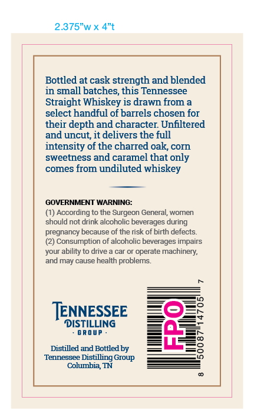
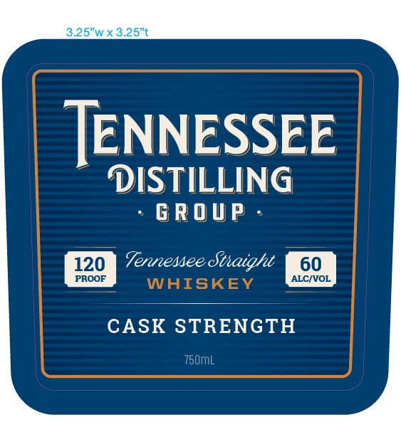

# TTB COLA Label Images - TTBID 26239001000352

**Brand Name:** TENNESSEE DISTILLING GROUP

**Issue Date:** 09/09/2026

**Origin Code:** 43

**Product Class/Type:** 109

**Source:** [TTB Public COLA Registry](https://ttbonline.gov/colasonline/viewColaDetails.do?action=publicFormDisplay&ttbid=26239001000352)

## Label Images

### Back Label

### Front Label

## Extracted Label Text

*Text extracted via OCR - may contain errors*

### Back Label

2.375"w x 4"t
Bottled at cask strength and blended
in small batches; this Tennessee
Straight Whiskey is drawn from a
select handful of barrels chosen for
their depth and character Unfiltered
and uncut, it delivers the full
intensity of the charred oak,corn
sweetness
caramel that only
comes from undiluted whiskey
GOVERNMENT WARNING:
According to the Surgeon General, women
should not drink alcoholic beverages during
pregnancy because of the rsk of birth defects
Consumption of alcoholic beverages impairs
your ability to drive
car or operate machinery;
and may cause health problems
TENNESSEE
DISTILYANG
8
Distilled and Bottledby
8
Tennessee _
Distilling Group
Columbia TN
and

### Front Label

TENNESSEE

DISTILLING

> GROUP -

Ternenee Staight
WMEREC
CASK STRENGTH

T50mL
