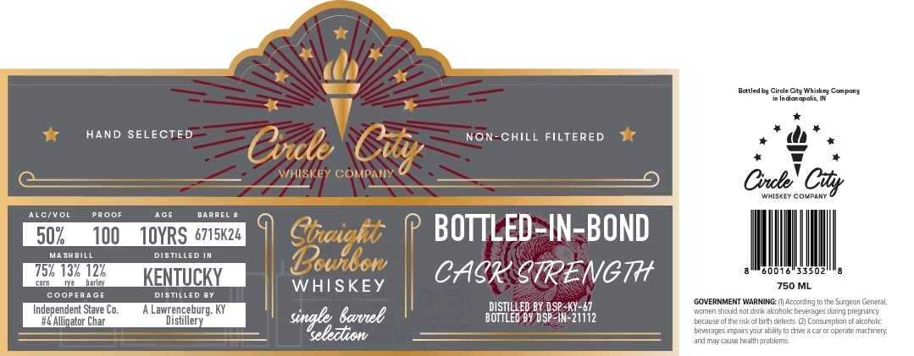

# TTB COLA Label Images - TTBID 26239001000387

**Brand Name:** CIRCLE CITY WHISKEY COMPANY

**Issue Date:** 09/02/2026

**Origin Code:** 19

**Product Class/Type:** 111

**Source:** [TTB Public COLA Registry](https://ttbonline.gov/colasonline/viewColaDetails.do?action=publicFormDisplay&ttbid=26239001000387)

## Label Images

### Label 1

## Extracted Label Text

*Text extracted via OCR - may contain errors*

### Label 1

Bottedou Cnc
Ctehiekeu
conpone
IneIn dlanac OMs
HAND SELECTED
Non-CHILL FILTERED
Coke
WHISKEY COMPAN
Cnl coCity
Whisk[Y COUPANT
AlivOL
PAOOF
AGE
BAAREL
502
100
1OYRS 6715K24
BOTTLED-IN-BOND
MA SHBILL
distilled
Booicei
7752 132 127
KENTUCKY
CABKCTRENCT+
33502
ballal
WHISKEY
750 ML
coopeRAGE
Disted
COVERNMENT WARNING: (I| According to tte
Garara
Independent Stave Co.
Lawrenceburg;
DISIILLED BY DSP-KY-67
"icMen scud nol dirk akoholcbeveraes
durn] pregnarcy
#4Alliqator Char
Distillery
singltezlionee

BOTTLEd BY DsPIN-21i2
Eecalse of the rkof brth celeds
Lcnsumplicn c-aizorolc
LeveragesinparsYOLr ablity t0 dT2 2 car
operale Machneri
ardTagsa tealh orcblems
Cdty
cugeo
