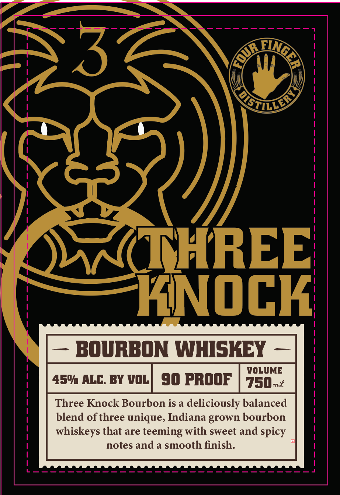
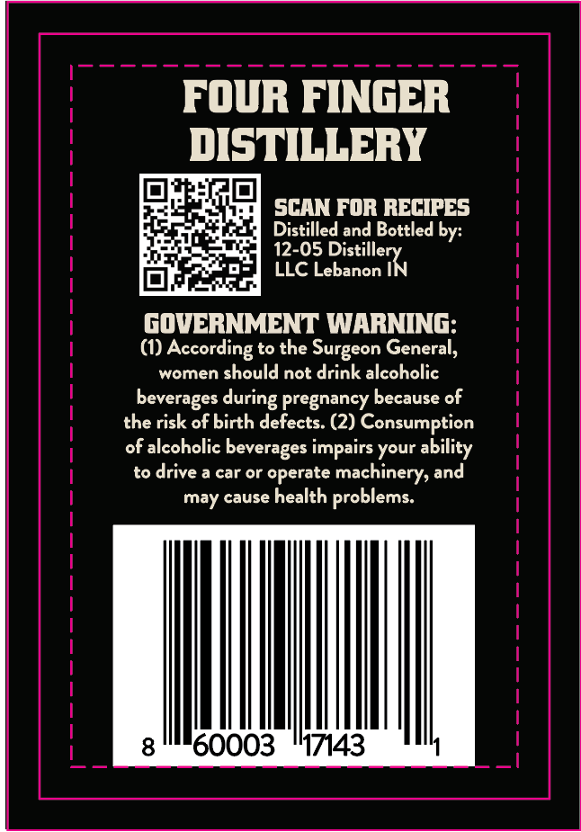

# TTB COLA Label Images - TTBID 26239001000454

**Brand Name:** FOUR FINGER DISTILLERY

**Fanciful Name:** THREE KNOCK BOURBON

**Issue Date:** 09/10/2026

**Origin Code:** 19

**Product Class/Type:** 141

**Source:** [TTB Public COLA Registry](https://ttbonline.gov/colasonline/viewColaDetails.do?action=publicFormDisplay&ttbid=26239001000454)

## Label Images

### Label 1

### Label 2

## Extracted Label Text

*Text extracted via OCR - may contain errors*

**Detected Proof:** 90

### Label 1

3
4stnu>
THREE
KNOCK
BOURBON WHISKEY
VOLUME
45% ALC: BY VOL
90 PROOF
750-2
Three Knock Bourbon is a deliciously balanced
blend of three unique, Indiana grown bourbon
whiskeys that are teeming with sweet and spicy
notes and a smooth finish:
AinGLR
GOUR

### Label 2

FOUR FINGER
DISTILLERY
SCAN FOR RECIPES
Distilled and Bottled by:
12-05
LLC Lebanon
ebanolerX
goVERNMENT WARNING:
(1) According to the
General,
women should not drink alcoholic
beverages
pregnancy because of
the risk of birth defects: (2) Consumption
of alcoholic beverages impairs your ability
to drive a car or operate
machinery, and
may cause health problems:
8
60003
'17143
Surgeon
during
