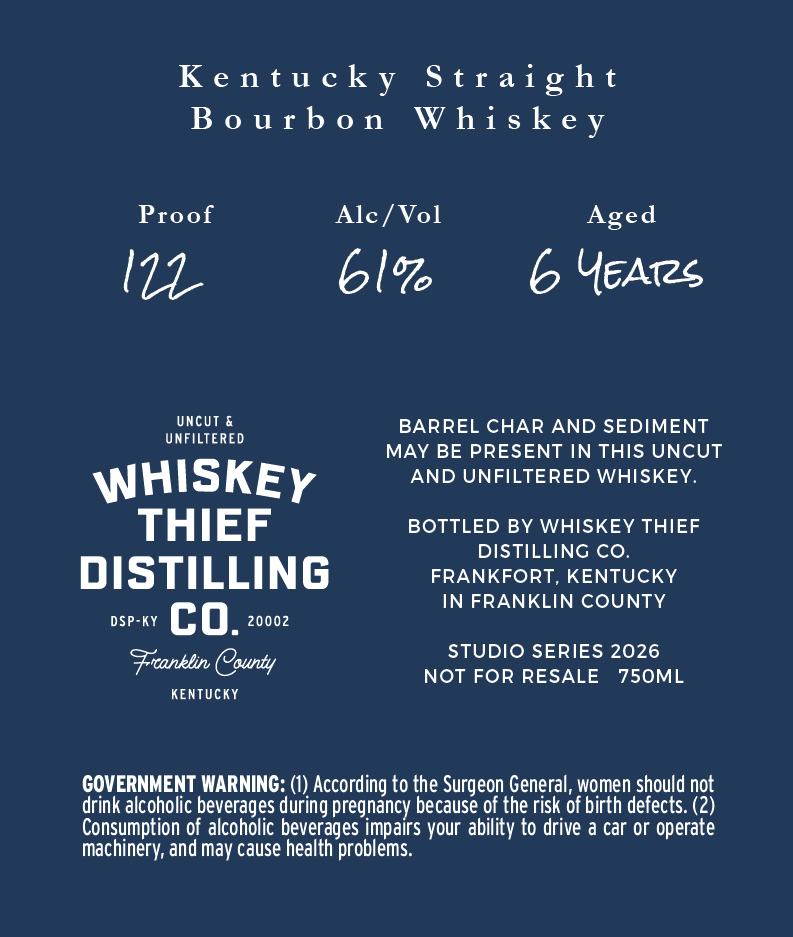
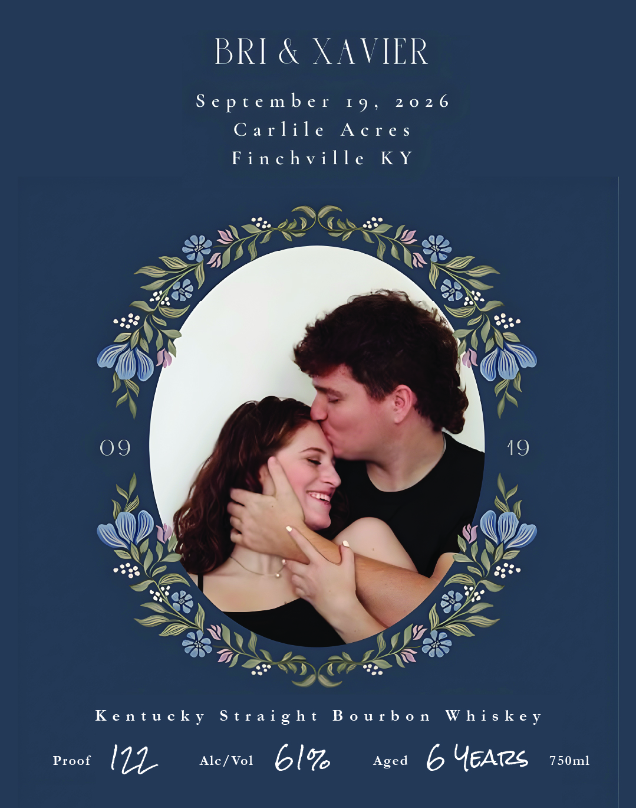

# TTB COLA Label Images - TTBID 26239001000466

**Brand Name:** WHISKEY THIEF DISTILLING CO.

**Fanciful Name:** BRI & XAVIER

**Issue Date:** 09/02/2026

**Origin Code:** 22

**Product Class/Type:** 101

**Source:** [TTB Public COLA Registry](https://ttbonline.gov/colasonline/viewColaDetails.do?action=publicFormDisplay&ttbid=26239001000466)

## Label Images

### Back Label

### Front Label

## Extracted Label Text

*Text extracted via OCR - may contain errors*

**Detected Age:** 6 Years

### Back Label

Kentucky Straight
Bourbon Whiskey

Proof Alc/Vol Aged

17 61% 6 Years

oes BARREL CHAR AND SEDIMENT
MAY BE PRESENT IN THIS UNCUT

WHISKEy AND UNFILTERED WHISKEY.
THIEF BOTTLED BY WHISKEY THIEF

DISTILLING CO.

DISTILLING FRANKFORT, KENTUCKY
IN FRANKLIN COUNTY
DSP-KY CO. 20002
Freanklin, County STUDIO SERIES 2026

NOT FOR RESALE 750ML
KENTUCKY

GOVERNMENT WARNING: (1) According to the Surgeon General, women should not
drink alcoholic beverages during pregnancy because of the risk of birth defects. (2)
Consumption of alcoholic beverages impairs your ability to drive a car or operate
machinery, and may cause health problems.

### Front Label

BRI & XAVIER

September 19, 2026
Carlile Acres
Finchville KY

Kentucky Straight Bourbon Whiskey

Proof Wee Alc/Vol 6 I% Aged 6 UEATeS 750ml
