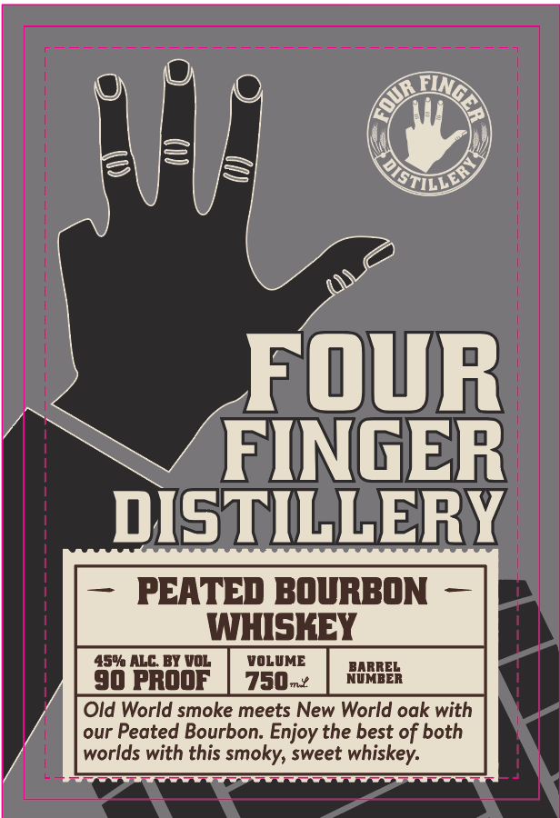
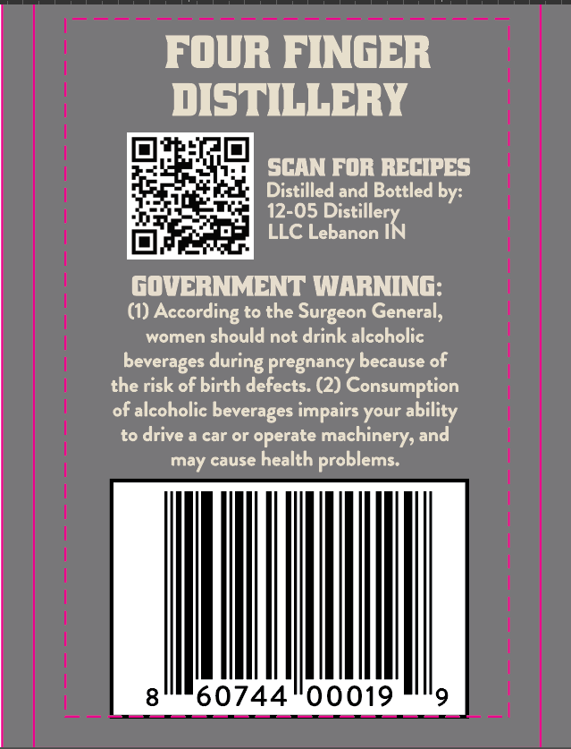

# TTB COLA Label Images - TTBID 26239001000482

**Brand Name:** FOUR FINGER DISTILLERY

**Fanciful Name:** PEATED BOURBON

**Issue Date:** 09/18/2026

**Origin Code:** 19

**Product Class/Type:** 141

**Source:** [TTB Public COLA Registry](https://ttbonline.gov/colasonline/viewColaDetails.do?action=publicFormDisplay&ttbid=26239001000482)

## Label Images

### Label 1

### Label 2

## Extracted Label Text

*Text extracted via OCR - may contain errors*

**Detected Proof:** 90

### Label 1

4R
FOUR
FINGER
DISTILLERY
PEATED BOURBON
WHISKEY
4506 ALC BY VoL
VOLUME
90 pROOF
750n*
HUEEER
Old World smoke meets New World oak with
our Peated Bourbon: Enjoy the best of both
worlds with this smoky, sweet whiskey:
TILLER=

### Label 2

FOUR FINGER ~
DISTILLERY

SCAN FOR RECIPES
Distilled and Bottled by:
12-05 Distiller

LLC Lebanon |

GOVERNMENT WARNING:
(1) According to the Surgeon General,
women should not drink alcoholic
beverages during pregnancy because of
the risk of birth defects. (2) Consumption
of alcoholic beverages impairs your ability
to drive a car or operate machinery, and
may cause health problems.

60744°00019
