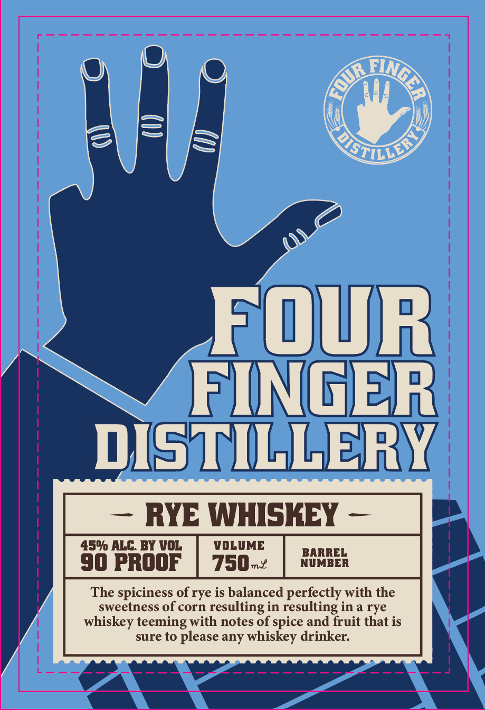
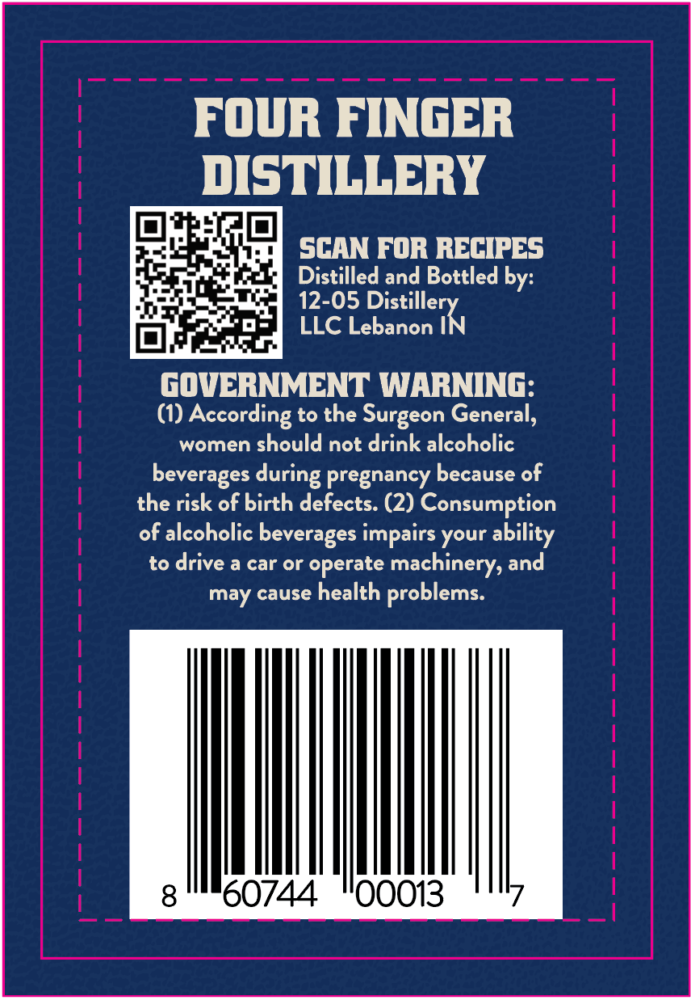

# TTB COLA Label Images - TTBID 26239001000510

**Brand Name:** FOUR FINGER DISTILLERY RYE WHISKEY

**Issue Date:** 09/15/2026

**Origin Code:** 19

**Product Class/Type:** 142

**Source:** [TTB Public COLA Registry](https://ttbonline.gov/colasonline/viewColaDetails.do?action=publicFormDisplay&ttbid=26239001000510)

## Label Images

### Label 1

### Label 2

## Extracted Label Text

*Text extracted via OCR - may contain errors*

**Detected Proof:** 90

### Label 1

FOUR
FINGER
DISTILLERY
RYE WHISKEY
459 ALG BY VOL
VOLUME
BARREL
90 PrOOF
750-
NUMBER
The spiciness of rye is balanced perfectly with the
sweetness of corn
resulting in resulting in a rye
whiskey teeming with notes Of spice and fruit that is
sure to please any whiskey drinker:
AinGLR
E(
StiLLld/
Im %

### Label 2

Four FINGER
DISTILLERY
SCAN FOR RECIPES
Distilled and Bottled by:
12-05
LLC Lebanon IN
gOVERNMENT WARNING:
(1)
According to the Surgeon General,
women should not drink alcoholic
beverages
pregnancy because of
the risk of birth defects. (2) Consumption
of alcoholic beverages impairs your ability
to drive a car or
operate machinerys and
may cause health
problems:
8
60744
00013
Distillery
during
