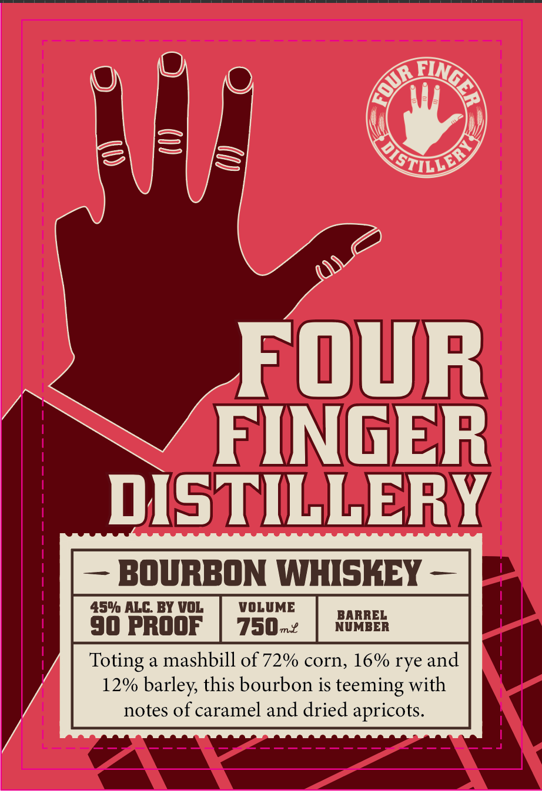
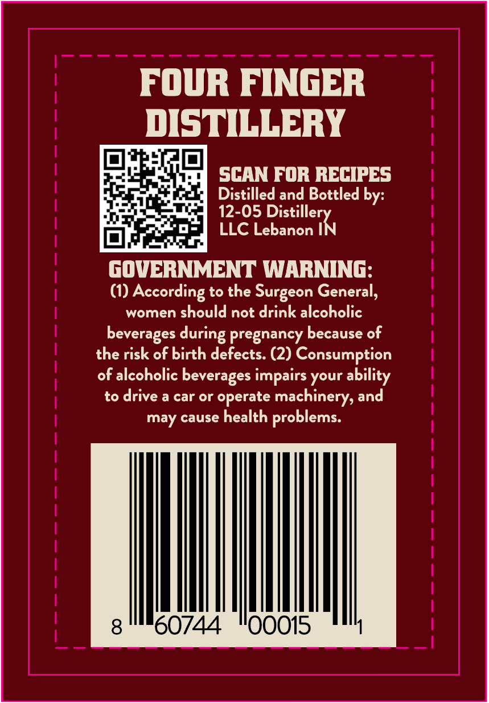

# TTB COLA Label Images - TTBID 26239001000521

**Brand Name:** FOUR FINGER DISTILLERY BOURBON WHISKEY

**Issue Date:** 09/11/2026

**Origin Code:** 19

**Product Class/Type:** 141

**Source:** [TTB Public COLA Registry](https://ttbonline.gov/colasonline/viewColaDetails.do?action=publicFormDisplay&ttbid=26239001000521)

## Label Images

### Label 1

### Label 2

## Extracted Label Text

*Text extracted via OCR - may contain errors*

**Detected Proof:** 90

### Label 1

FOUR
FINGER
DISTILLERY
BOURBON WHISKEY
450 ALG BY VOL
VOLUME
BARREL
90 PROOF
750m2
NUMBER
Toting
a
mashbill of 72% corn, 16% rye and
12% barley, this bourbon is teeming with
notes of caramel and dried apricots.
Aingla
E(
StiLLloy

### Label 2

FOUR FINGER
DISTILLERY

daa SCAN FOR RECIPES
Yat. Distilled and Bottled by:
4 a. Tie 12-05 Distille
oe LLC Lebanon IN

GOVERNMENT WARNING:
(1) According to the Surgeon General,
women should not drink alcoholic
beverages during pregnancy because of

the risk of birth defects. (2) Consumption
of alcoholic beverages impairs your ability
to drive a car or operate machinery, and
may cause health problems.
