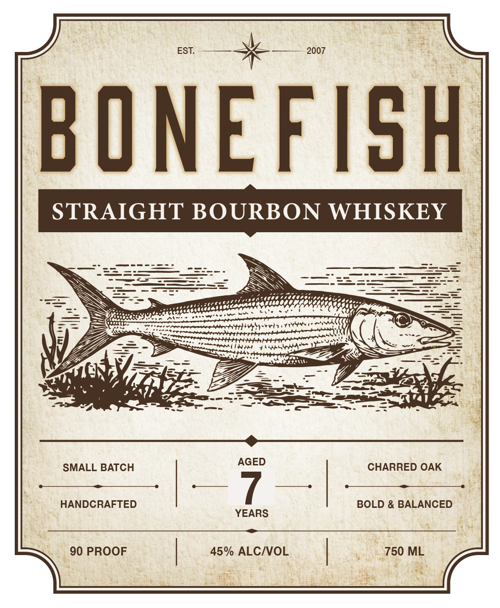
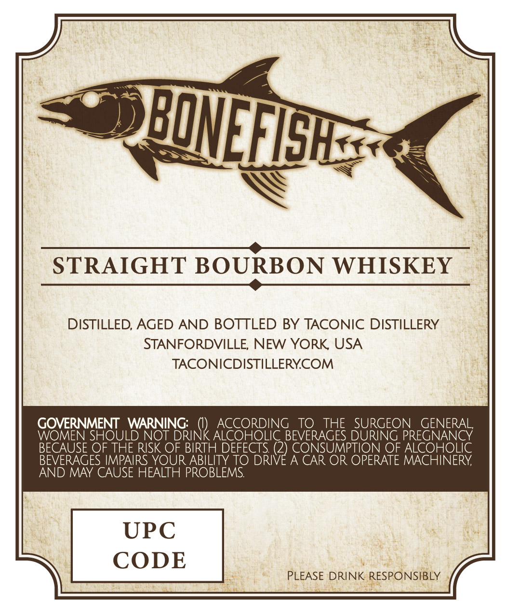

# TTB COLA Label Images - TTBID 26239001000640

**Brand Name:** BONEFISH

**Issue Date:** 09/03/2026

**Origin Code:** 02

**Product Class/Type:** 101

**Source:** [TTB Public COLA Registry](https://ttbonline.gov/colasonline/viewColaDetails.do?action=publicFormDisplay&ttbid=26239001000640)

## Label Images

### Label 1

### Label 2

## Extracted Label Text

*Text extracted via OCR - may contain errors*

**Detected Proof:** 90

### Label 1

Pocorereooe aber ttt] ty we) tite CS

seatermenersresattayamurennitiateret ery
PA TW teh Lib
TY ribet

gue rs

SMALL BATCH CHARRED OAK

= >

HANDCRAFTED BOLD & BALANCED
YEARS

—

90 PROOF 45% ALC/VOL

### Label 2

STRAIGHT BOURBON WHISKEY
DISTILLED; AGED AND BOTTLED BY TACONIC DISTILLERY
STANFORDVILLE NEW YORK USA
TACONICDISTILLERYCOM
GOVERNMENT
WARNING:
ACCORDING
TO
THE
SURGEON
GENERAL,
WOMEN SHOULD NOT
VRINk ACOORINGEVORAGEE DURGEO PREGEMERAY
BECAUSE OF THE RISK OF BIRTH DEFECTS (2) CONSUMPTION OF ALCOHOLIC
BEVERAGES IMPAIRS YOUR ABILITY TO DRIVE A CAR OR OPERATE MACHINERY
AND MAY CAUSE HEALTH PROBLEMS:
UPC
CODE
PLEASE DRINK RESPONSIBLY
BOEFHE
