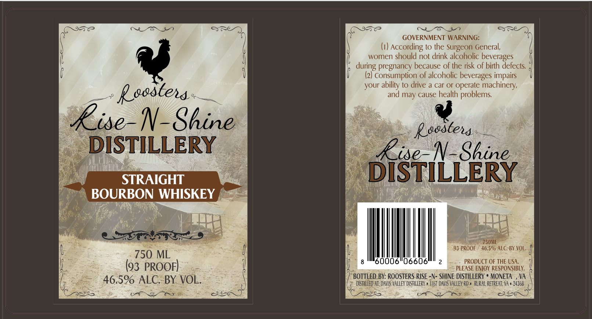

# TTB COLA Label Images - TTBID 26239001000658

**Brand Name:** ROOSTERS RISE -N- SHINE DISTILLERY STRAIGHT BOURBON WHISKEY

**Issue Date:** 09/04/2026

**Origin Code:** 05

**Product Class/Type:** 101

**Source:** [TTB Public COLA Registry](https://ttbonline.gov/colasonline/viewColaDetails.do?action=publicFormDisplay&ttbid=26239001000658)

## Label Images

### Label 1

## Extracted Label Text

*Text extracted via OCR - may contain errors*

**Detected Proof:** 92

### Label 1

GOVERNMENT WARNING:
(i)
According to the Surgeon General,
women should not drink alcoholic beverages
during pregnancy because of the risk of birth defects:
Consumption of alcoholic beverages impairs
your
to
drive a car or operate machinery,
Reostena
and may cause health problems
Rise-N-Shine
Reostend
DISTILLERY
Rise_N-Shine
STRAIGHT
DiSTILLERY
BOURBON WHISKEY
750ML
9} PROOF
46,590 ALC, BY VOL;
750 ML
066
PRODUCT OF THE USA;
(93 PROOF)
PLEASE ENIOY RESPONSIBLY:
BOTTLED BY: ROOSTERS RISE -N- SHINE DISTILLERY
MONETA
VA
46.59 ALC. BY VOL:
DiStILled AT: DAVIS Valley DUSTILLERY , |167 DAVIS Valley RD , RlraL retreat; Va , 24368
ability
