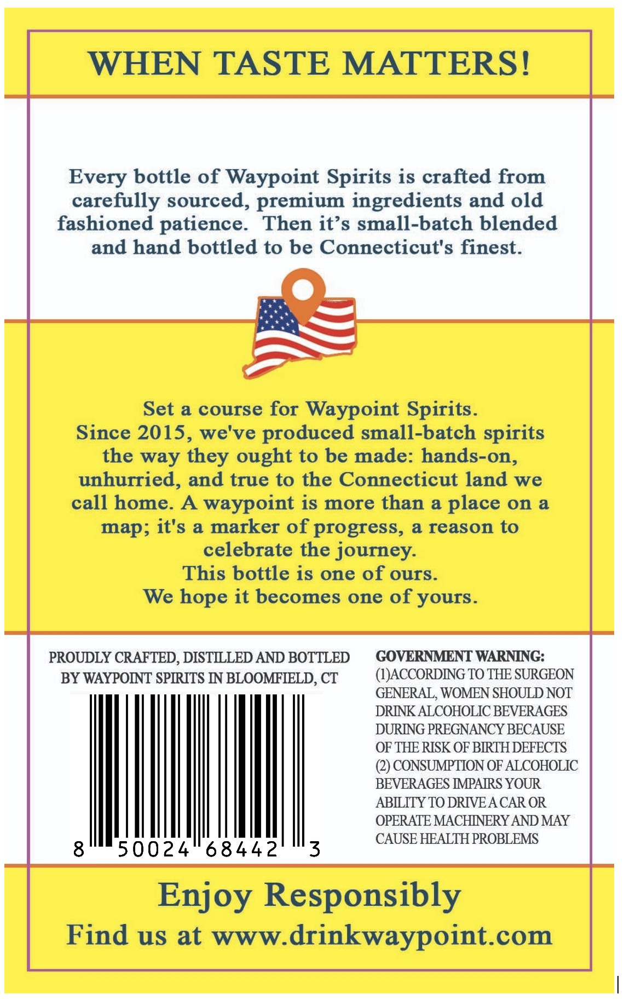
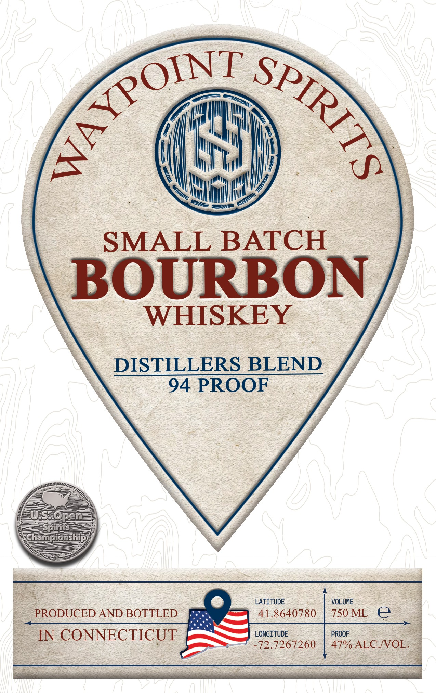

# TTB COLA Label Images - TTBID 26239001000659

**Brand Name:** WAYPOINT SPIRITS

**Fanciful Name:** SMALL BATCH, DISTILLERS BLEND

**Issue Date:** 09/03/2026

**Origin Code:** 14

**Product Class/Type:** 141

**Source:** [TTB Public COLA Registry](https://ttbonline.gov/colasonline/viewColaDetails.do?action=publicFormDisplay&ttbid=26239001000659)

## Label Images

### Back Label

### Front Label

## Extracted Label Text

*Text extracted via OCR - may contain errors*

**Detected Proof:** 94

### Back Label

WHEN TASTE MATTERS!
Every bottle of Waypoint Spirits is crafted from
carefully sourced, premium ingredients and old
fashioned patience.
Then it' s small-batch blended
and hand bottled to be Connecticut's finest:
Set a course for
Waypoint Spirits.
Since 2015, we've produced small-batch
the way
ought to be made: hands-on,
unhurried, and true to the Connecticut land we
call home
A
waypoint is more than a
on a
map; it's a marker of progress, & reason to
celebrate the journey:
This bottle is one of ours.
We hope it becomes one of yours.
PROUDLY CRAFTED , DISTLLED AND BOTTLED
GOVERNMENT WARNING:
BY WAYPOINT SPRRITS IN BLOOMFIELD, CT
(#LJACCORDNNG TO THE SURGEON
GENERAL, WOMEN SHOULD NOT
DRINK ALCOHOLIC BEVERAGES
DURING PREGNANCY BECAUSE
OF THE RISK OF BRTH DEFECTS
(2) CONSUMPTION OF ALCOHOLIC
BEVERAGES IPARS YOUR
ABLLITY TO DRIVEA CAR OR
OPERATE MACHINERY AND MAY
CAUSE HEALTH PROBLEMS
8
50024
68442
3
Enjoy Responsibly
Find us at WWw drinkwaypoint_com
spirits
they
place

### Front Label

SMALL BATCH
BOURBON
WHISKEY
DISTILLERS BLEND
94 PROOF
US  @pen
Spirits
Championship
LATITUDE
VOLUME
PRODUCED AND BOTTLED
41.8640780
750 ML
e
IN CONNECTICUT
LONGITUDE
PROOF
72.7267260
47% ALC NOL.
AKYPOINT
SPIRITS
