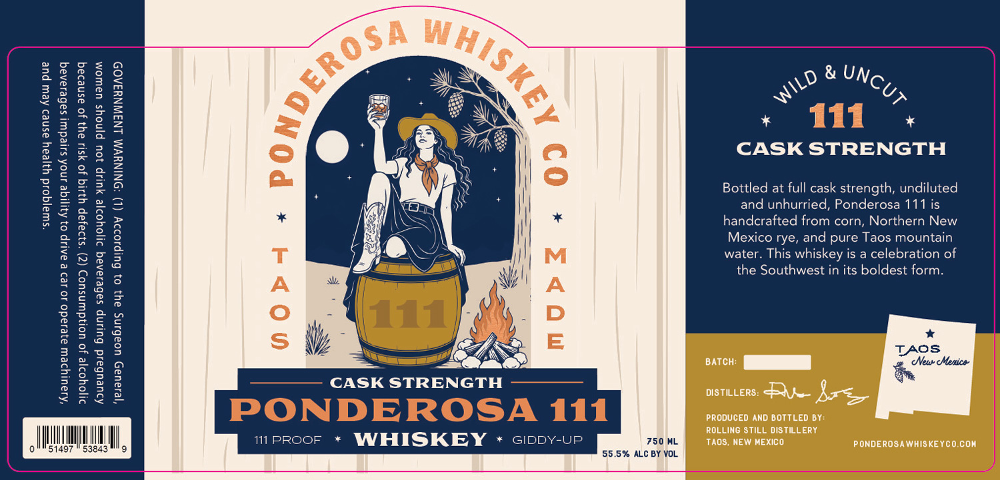

# TTB COLA Label Images - TTBID 26239001000663

**Brand Name:** ROLLING STILL

**Fanciful Name:** PONDEROSA 111

**Issue Date:** 09/03/2026

**Origin Code:** 34

**Product Class/Type:** 140

**Source:** [TTB Public COLA Registry](https://ttbonline.gov/colasonline/viewColaDetails.do?action=publicFormDisplay&ttbid=26239001000663)

## Label Images

### Label 1

### Label 2

## Extracted Label Text

*Text extracted via OCR - may contain errors*

*1 image(s) excluded: text did not meet readability threshold*

**Detected Proof:** 111

### Label 1

*swajqoid yyjeay asned Aew pue

*Kiauiyrew ajesado 10 129 & aAlip 03 Ayjige AnoA sujedui} sabesanaq
dIjoyorje Jo uo!ydwinsuo> (Z) °s}2aJap YIIq Jo yS1U B43 Jo asneraq

CASK STRENGTH

"212Ua5 uoabing ay} 0} Gulpso2>y (1) ‘ONINYVM LNSWNY3AO9

Adueubaid Bulinp sabeiarag 21joyooje yup Jou pjnoys uaWwoM

IMUM mprooF * WHISKEY ~* ciopy-up 750 ML

51497 55.5% ALC BY VOL.

» Wii .
CASK STRENGTH

Bottled at full cask strength, undiluted
and unhurried, Ponderosa 111 is
handcrafted from corn, Northern New
Mexico rye, and pure Taos mountain
water. This whiskey is a celebration of
the Southwest in its boldest form.

*
TASS
ant a

DISTILLERS: Qe Arte

PRODUCED AND BOTTLED BY:
ROLLING STILL DISTILLERY
TAOS, NEW MEXICO PONDEROSAWHISKEYCO.CON
