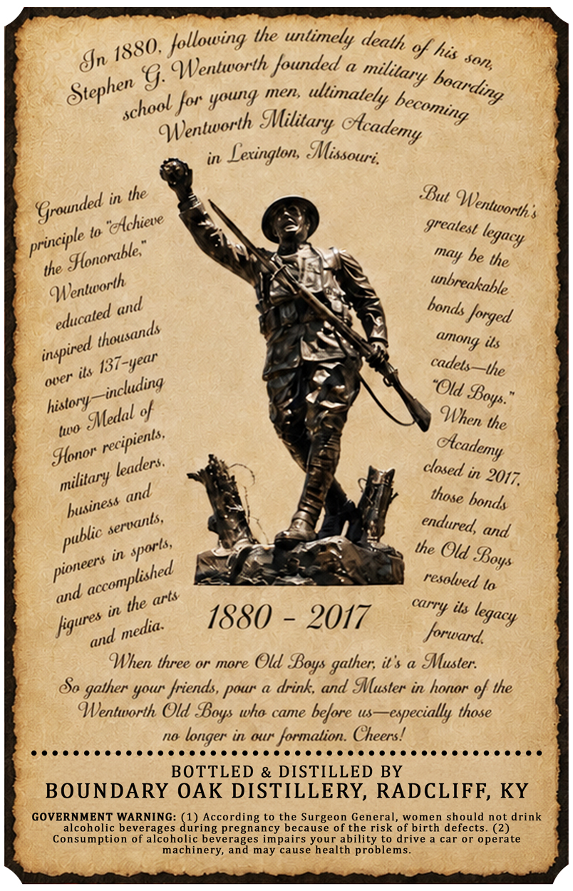
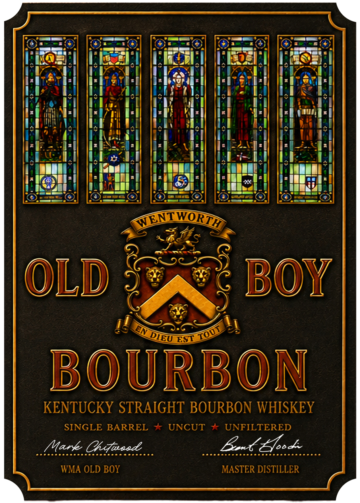

# TTB COLA Label Images - TTBID 26239001000695

**Brand Name:** OLD BOY BOURBON

**Issue Date:** 10/06/2026

**Origin Code:** 22

**Product Class/Type:** 101

**Source:** [TTB Public COLA Registry](https://ttbonline.gov/colasonline/viewColaDetails.do?action=publicFormDisplay&ttbid=26239001000695)

## Label Images

### Back Label

### Front Label

## Extracted Label Text

*Text extracted via OCR - may contain errors*

### Back Label

the untimely
%f his
Un
"Wentworth founded
'9:
mnen;
for young
MMilitary
in
Lexinglon; SMissouri.
in the
SBut
lo
greatest
he the
the
forged
its
its
137-year
the
history
of
the
in 2017,
and
in
the Old
to
in the
its
1880
2017
forward
When three or more Old
it $
MMuster:
80
your friends,
drink  and Mlluster in honor % the
Wentworth Old
who came before us
-especially those
no
in &tr"
formalion. Cheers!
BOTTLED & DISTILLED BY
BOUNDARY OAK DISTILLERY, RADCLIFF, KY
GOVERNMENT WARNING: (1) According to the Surgeon General,
women should not drink
alcoholic beverages during pregnancy because of the risk of birth defects. (2)
Consumption of alcoholic beverages impairs your ability to drive
car or operate
machinery, and may cause health problems_
Jollowing
death
1880,
son,
military
boarding
Stephen
ultimately
becoming
school
Wentworth
Olcademy
Wentworth$
Grounded
"exchiete
legacy
principle
Slonorable"
may
unbreakable
Wentworth
bonds
and
educated
thousands
cunong
inspired
cadets
over
-including
"Old _
Soys.
Mledal =
When
tuo
recipients,
dlcademy
Slonor
teaders.
closed
military
and
those
bonds
husiness
sertants,
endured,
public _
sports,
Soys
pioneers
accomplished
resolved
and
arts
carry
legacyy
ligures
media.
and
Boys ;
gather;
gather
pour
Soys
longer

### Front Label

NENTWORI
OLD
Boy
EST
BOURBON
KENTUCKY STRAIGHT BOURBON WHISKEY
SINGLE BARREL
J
UNCUT
UNFILTERED
Mark Ohituead
Exx Zz
WMA OLD BOY
MASTER DISTILLER
TO
DIEU
