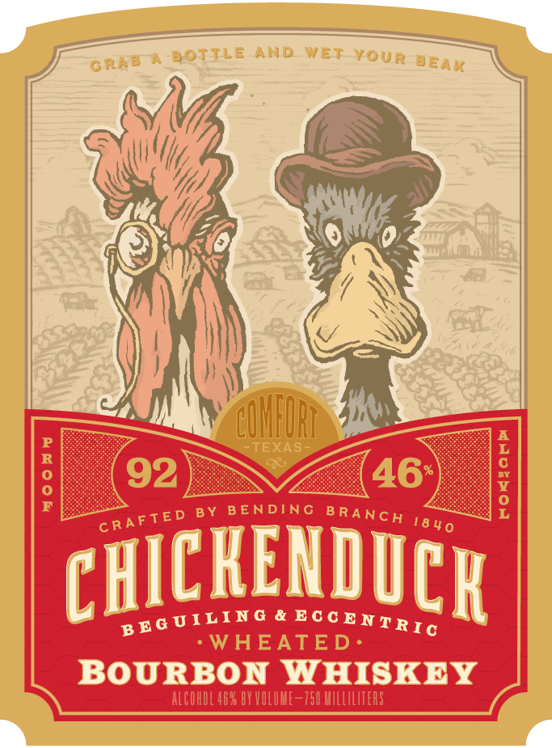
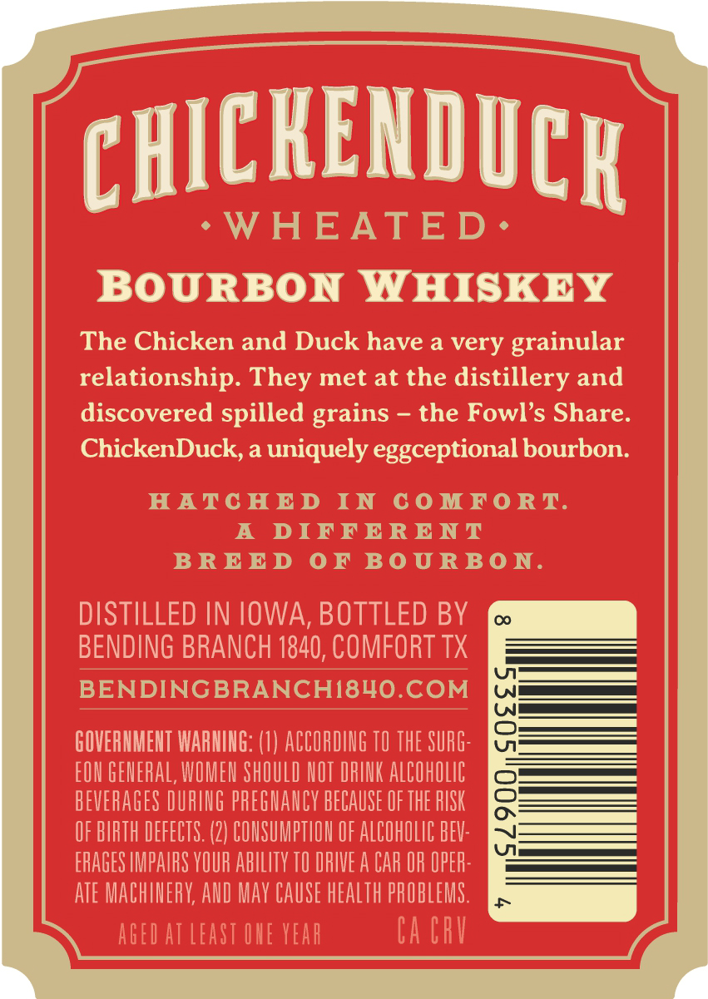

# TTB COLA Label Images - TTBID 26239001000719

**Brand Name:** CHICKENDUCK

**Fanciful Name:** WHEATED

**Issue Date:** 09/04/2026

**Origin Code:** 44

**Product Class/Type:** 141

**Source:** [TTB Public COLA Registry](https://ttbonline.gov/colasonline/viewColaDetails.do?action=publicFormDisplay&ttbid=26239001000719)

## Label Images

### Front Label

### Label 2

## Extracted Label Text

*Text extracted via OCR - may contain errors*

### Front Label

BOTTLE
AMDD
WTET
YouR
CUHFURI
TEXAS
;
92
46

BY
B ENDING
chickendiCR
WHEATED.
BOURBON WAISKEY
ALCOHOL 46X BY VOLUHE-750 MILLILITERS
GRAB
BEAK
B RA NCH
CRAFTED
18 4 0
B EG UILING
Ec c ENTRIc

### Label 2

CHICKENDICK
WHEATED.
BOURBON
WAISKEY
The Chicken and Duck have a very
grainular
relationship. They met at the distillery and
discovered spilled grains
the Fowl's Share.
ChickenDuck, a uniquely
eggceptional bourbon:
HATC HE D
IN
C0 MFORT.
A
DIFFERENT
BRE E D
0 F
B0 U RB0 N.
DISTILLED IN IOWA, BOTTLED BY
0
BENDING BRANCH 1840, COMFORT TX
BENDINGBRANCHI8HO.COM
GOVERHMEHT WARHIHG: (1} ACCORING TO THE SURG:
EOU GEHERAL, WOMEN ShOULD LOT DRINK ALCOHOLIC

BEVERAGES DURING pREGHAUCY BECAUSE OF THE PISK
OF BIRTH DEFECTS. (2) COHSUMPTLOH OF ALCOHOLIC BEV:
ERAGES IMPAIRS YOUR AbILITY TO IRIVE A CAR OR OPER:
ate MACHINERY; AND May CaUSe health PROBLEMS.
AGed at Least OUE vEar
Ca CRV
