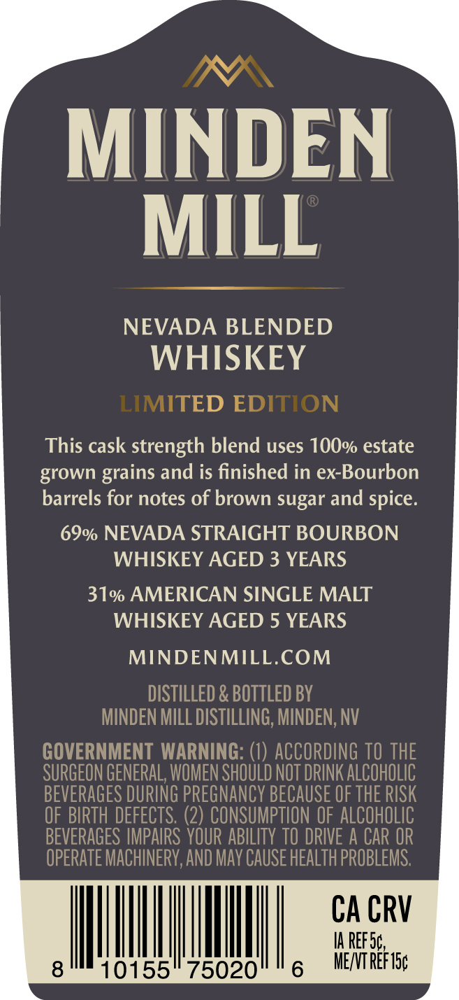
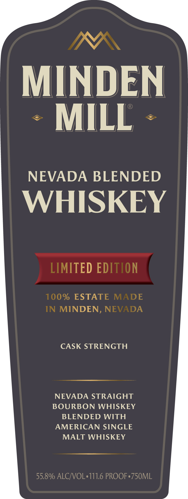

# TTB COLA Label Images - TTBID 26239001000850

**Brand Name:** MINDEN MILL

**Fanciful Name:** LIMITED EDITION NEVADA BLENDED

**Issue Date:** 09/18/2026

**Origin Code:** 32

**Product Class/Type:** 137

**Source:** [TTB Public COLA Registry](https://ttbonline.gov/colasonline/viewColaDetails.do?action=publicFormDisplay&ttbid=26239001000850)

## Label Images

### Back Label

### Front Label

### Label 3

## Extracted Label Text

*Text extracted via OCR - may contain errors*

*1 image(s) excluded: text did not meet readability threshold*

**Detected Proof:** 111.6
**Detected Age:** 3 Years

### Back Label

MINDEN
MILL
NEVADA BLENDED
WHISKEY
LIMITED EDITION
This cask strength blend uses 100% estate
grown grains and is finished in ex-Bourbon
barrels for notes of brown sugar and spice:
69% NEVADA STRAIGHT BOURBON
WHISKEY AGED 3 YEARS
31% AMERICAN SINGLE MALT
WHISKEY AGED 5 YEARS
MINDENMILL.COM
DISTILLED & BOTTLED BY
MINDEN MILL DISTILLING, MINDEN;, NV
GOVERNMENT WARNING: (1) ACCORDING TO THE
SURGEON GENERAL, WOMEN SHOULD NOT DRINK AlCOhOLIC
BEVERAGES DURING PREGNANCY BECAUSE OF THE RISK
OF BIRTH DEFECTS. (2) CONSUMPTION OF ALCOHOLIC
BEVERAGES IMPAIRS YOUR ABILITY TO DRIVE A CAR OR
OPERATE MACHINERV,AND May CAUSe HEALTh PROBLEMS:
CA CRV
IA REF Sc
8
10155
75020
5
MENT REF I5c

### Front Label

MINDEN
MILL
NEVADA BLENDED
WHISKEY
LIMITED EDITION
100% ESTATE
MADE
IN MINDEN, NEVADA
CASK STRENGTH
NEVADA STRAIGHT
BOURBON WHISKEY
BLENDED WITH
AMERICAN SINGLE
MALT WHISKEY
55.8% ALCJVOL'111.6 PROOF.750ML
