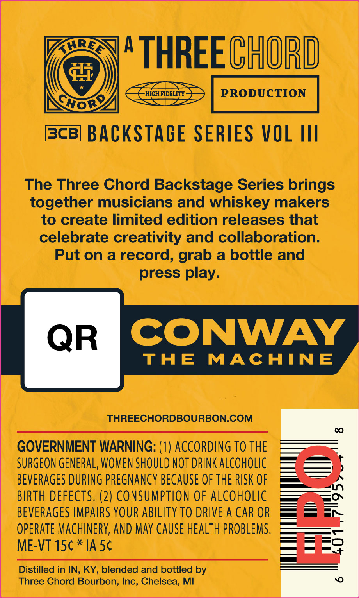
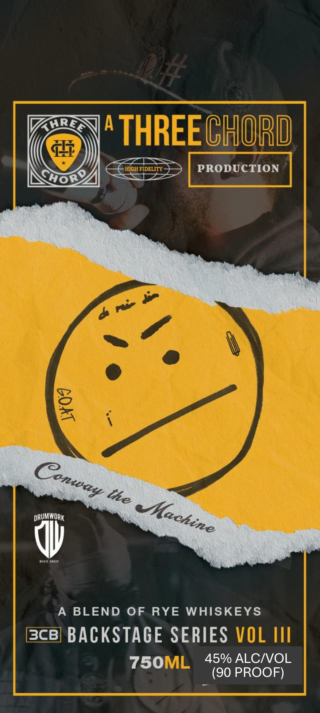

# TTB COLA Label Images - TTBID 26240001000094

**Brand Name:** THREE CHORD

**Issue Date:** 09/04/2026

**Origin Code:** 06

**Product Class/Type:** 132

**Source:** [TTB Public COLA Registry](https://ttbonline.gov/colasonline/viewColaDetails.do?action=publicFormDisplay&ttbid=26240001000094)

## Label Images

### Back Label

### Front Label

## Extracted Label Text

*Text extracted via OCR - may contain errors*

**Detected Proof:** 90

### Back Label

"THREE CHORD

ok

BACKSTAGE SERIES VOL III

The Three Chord Backstage Series brings

together musicians and whiskey makers

to create limited edition releases that

celebrate creativity and collaboration.

Put on a record, grab a bottle and

press play.

CONWAY

THE MACHINE

THREECHORDBOURBON.COM

GOVERNMENT WARNING: (1) ACCORDING TO THE

SURGEON GENERAL, WOMEN SHOULD NOT DRINK ALCOHOLIC

BEVERAGES DURING PREGNANCY BECAUSE OF THE RISK OF

BIRTH DEFECTS. (2) CONSUMPTION OF ALCOHOLIC

BEVERAGES IMPAIRS YOUR ABILITY TO DRIVE A CAR OR

OPERATE MACHINERY, AND MAY CAUSE HEALTH PROBLEMS

ME-VT 15¢ * 1A 5¢

Distilled in IN, KY, blended and bottled by

Three Chord Bourbon, Inc, Chelsea, Ml

### Front Label

Hrea
A
THREECHORD
HIGH FIDELITY
PRODUCTION
DRUMWORK
A
BLEND
OF
RYE
WHISKEYS
BcB] BACKSTAGE SERIES VOL IlI
750ML
45% ALCIOL
(90 PROOF)
CHo8
8
Conway
the
MMachine
