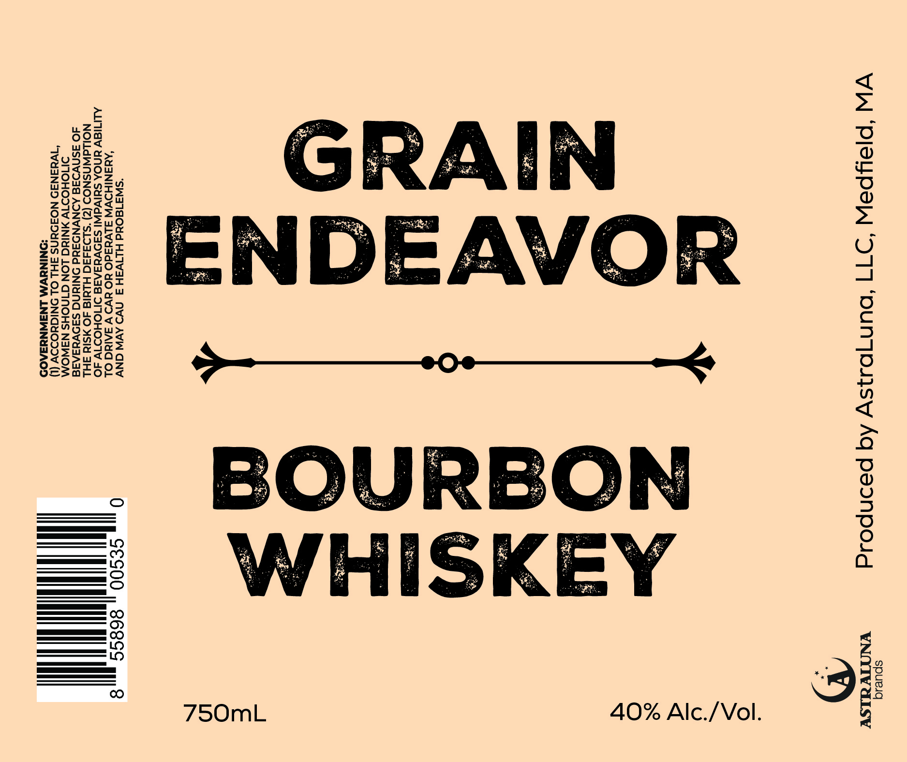

# TTB COLA Label Images - TTBID 26240001000095

**Brand Name:** GRAIN
ENDEAVOR

**Issue Date:** 09/18/2026

**Origin Code:** 26

**Product Class/Type:** 141

**Source:** [TTB Public COLA Registry](https://ttbonline.gov/colasonline/viewColaDetails.do?action=publicFormDisplay&ttbid=26240001000095)

## Label Images

### Label 1

## Extracted Label Text

*Text extracted via OCR - may contain errors*

**Detected Proof:** 80

### Label 1

spuesq

VW ‘PIPSLPEW ‘977 ‘ouNqO3s\y Aq pasnpoigd YNOIVUISY

”)

40% Alc./Vol.

750mL

“SW3180ud HLTW3SH 3 NWS AVW ONV

‘AMANIHOVW SLVdadO YO UV) V SAIN OL 0 S€S00 8685 8
ALITIEV YNOA SUIVdWI SADVYUAAAE DMIOHODT1V AO
NOILGWNSNOD (2) ‘S1934490 HLYId 40 MSId SHL
dO ASNVI3AE ADNVNO3Ud ONINNG SADVesAI8
SMOHODTV ANINd LON GINOHS NSNOM
“IWuAN3D NOFOUNS FHL OL ONIGUODOV (1)
‘ONINYVM LNSWNU3ZA09
