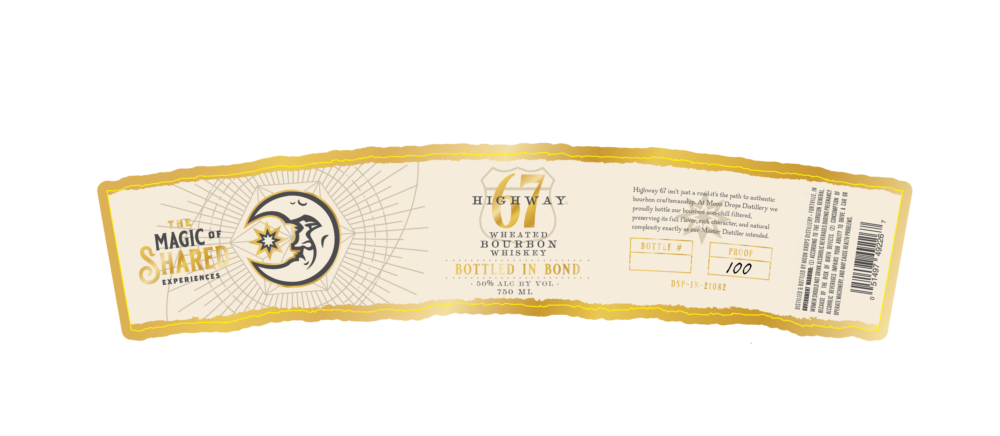

# TTB COLA Label Images - TTBID 26240001000125

**Brand Name:** MOON DROPS DISTILLERY

**Fanciful Name:** HIGHWAY 67 WHEATED BOURBON

**Issue Date:** 09/24/2026

**Origin Code:** 19

**Product Class/Type:** 111

**Source:** [TTB Public COLA Registry](https://ttbonline.gov/colasonline/viewColaDetails.do?action=publicFormDisplay&ttbid=26240001000125)

## Label Images

### Label 1

## Extracted Label Text

*Text extracted via OCR - may contain errors*

### Label 1

SOME ;
Weel CE wa
EW) SE 2
HRS Ls HIGH WAY Highway 67 ist just roads
a, Ss ® bourbon craftsman Oad-it's the path to auth S225 a
PIC oF Shs = EE / | proudly bottle ue, Drops Datei entic 5 = = = 2
VMAVUIN $7 al > a preserving its ful ill filtered Ss=s=
ar a Be 4% =a TL, HEATED complexity exac ter, and ¢ 222235
70° aus LY / a J =r, BOURBO ees Dies Sess =
1 ub oi Ney REY — Bynsiey BOTTLE # ‘ilitess © BEES EE Eee
“ KY SEQ BOTTLED 1 GO Sooo kG e | PROOF esses =
ESPNS ee wo ye &
WOH © Sgisss IN
Lebo E MWS - 750 ML a DSP-IN-21089 Egs282 =
=ESss = °
