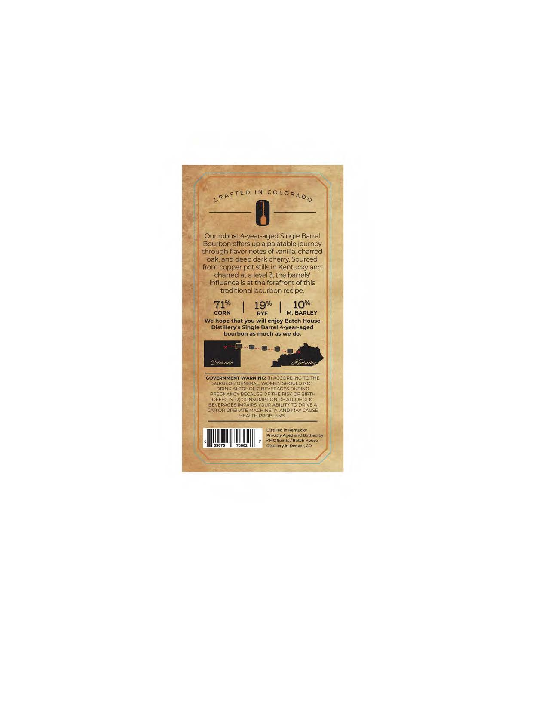
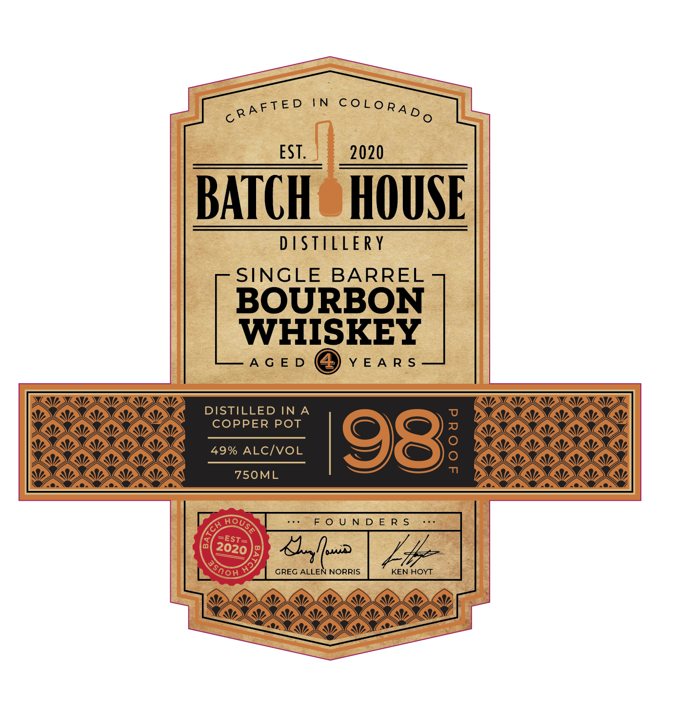

# TTB COLA Label Images - TTBID 26240001000197

**Brand Name:** SINGLE BARREL

**Issue Date:** 09/10/2026

**Origin Code:** 13

**Product Class/Type:** 141

**Source:** [TTB Public COLA Registry](https://ttbonline.gov/colasonline/viewColaDetails.do?action=publicFormDisplay&ttbid=26240001000197)

## Label Images

### Back Label

### Front Label

## Extracted Label Text

*Text extracted via OCR - may contain errors*

**Detected Proof:** 142

### Back Label

IN
Our robust 4-year-aged Single Barrel
Bourbon offers up a palatable journey
through flavor notes of vanilla, charred
oak and deep dark cherry: Sourced
from copper
stills in Kentucky and
charred at a level 3,the barrels'
influence isat the forefront of this
traditiona
bourbon recipe
71%
19%
10%
CORN
RYE
M: BARLEY
We hope that you will enjoy Batch House
Distillery"s Single Barrel 4-year-aged
bourbon as much as we do.
COattato
GOVERNMENT WARNING: (I) ACCORDING TO THE
SURGEON CENERAL; WOMEN SHQULD NOT
DRINK ALCOHOLIC BEVERAGES DURING
PREGNANCY BECAUSE OF THE RISK OF BIRTH
DEFECTS. (2 CONSUMPTION OF ALCOHOLIC
BEVERAGES IMPAIRS YOUR ABILITY TO DRIVE
CAR OR OPERATE MACHINERY, AND MAY CAUSE
HEALTH PROBLEMS;
Distilled
Kontucky
Proudly Aged and Bottled by
d
Spirits
Batch House
59675
0662
Distillery in Denver; CO:
coLoRAD 0
cRA FTE D
pot :

### Front Label

AFTED IN reg ag

oR

I. aoe ys

IBATCH HOUSE

DISTILLERY
SINGLE BARREL

BOURBON
Mea

DISTILLED INA
COPPER POT

49% ALC/VOL

&J =
GREG ALLEN NORRIS
