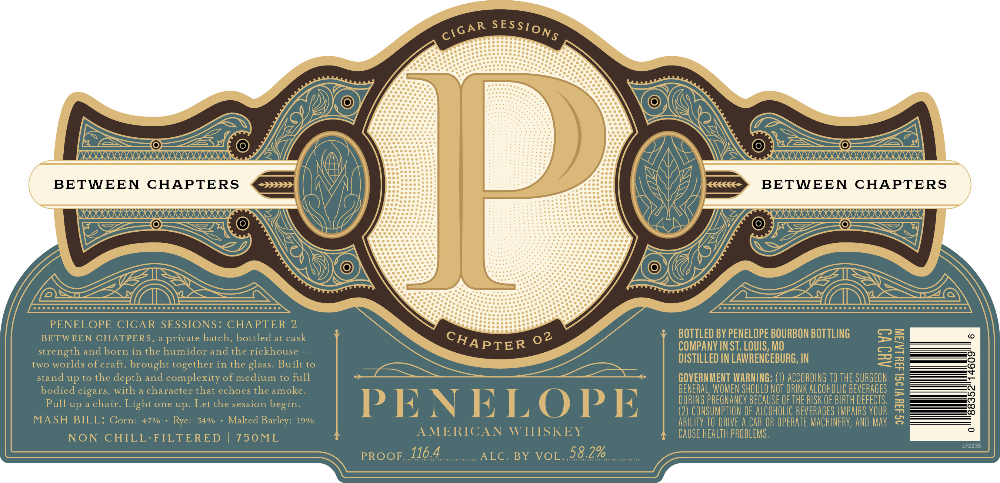
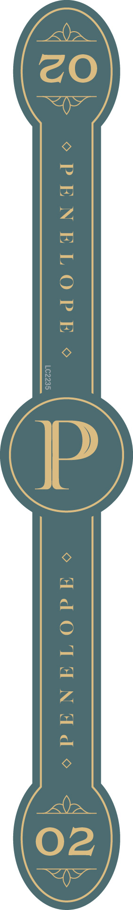

# TTB COLA Label Images - TTBID 26240001000290

**Brand Name:** PENELOPE

**Issue Date:** 09/04/2026

**Origin Code:** 29

**Product Class/Type:** 140

**Source:** [TTB Public COLA Registry](https://ttbonline.gov/colasonline/viewColaDetails.do?action=publicFormDisplay&ttbid=26240001000290)

## Label Images

### Label 1

### Label 2

## Extracted Label Text

*Text extracted via OCR - may contain errors*

*1 image(s) excluded: text did not meet readability threshold*

**Detected Proof:** 68

### Label 1

BETWEEN
CHAPTERS
rrkkkk
BETWEEN
CHAPTERS
PENELOPE CIGAR SESSIONS: CHAPTER 2
BETWEEN CHATPERS ,
private batch, bottled at cask
BOTTLED BY PENELOPE BOURBON BOTTLING
2
(0
strength and born in the humidor
the rickhouse
COMPANY IN ST. LOUIS, MO
1
two worlds of craft, brought together in the glass. Built to
DISTILLED IN LAWRENCEBURG, IN
g
stand up to the depth and complexity of medium to full
GOVERNMENT WARNING: (1) ACCORDING TO ThE SURGEON
bodied cigars, with
character that echoes the smoke.
GENERAL, WOMEN SHOULD NOT DRINK ALCOHOLIC bEvERAGES
2
Pull up a chair.
Light
one up. Let the session
begin:
PENELOPE
DURING PREGNANCY BECAUSE OF THE RISK OF BIRTH DEFECTS;
3
(2) CONSUMPTION OF AlCOhOLIC beverages IMPAIRS VOUR
3
MASH BILL: Corn: 470
Rye:
34%
Malted
19%
AbIlIty TO DRIVE A CAR OR Operate MAChiNERV, AND May
NON
CHILL-FILTERED
75 0 ML
AMERICAN
WHISKEY
Cause health PROBLEMS,
LF2235
PROOF_116.4
ALC. BY VOL.58.2%
SES SONS
CIGAR
CHAPTER
02
and
Barley:
