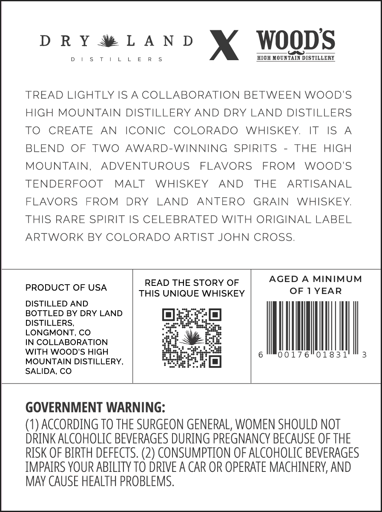
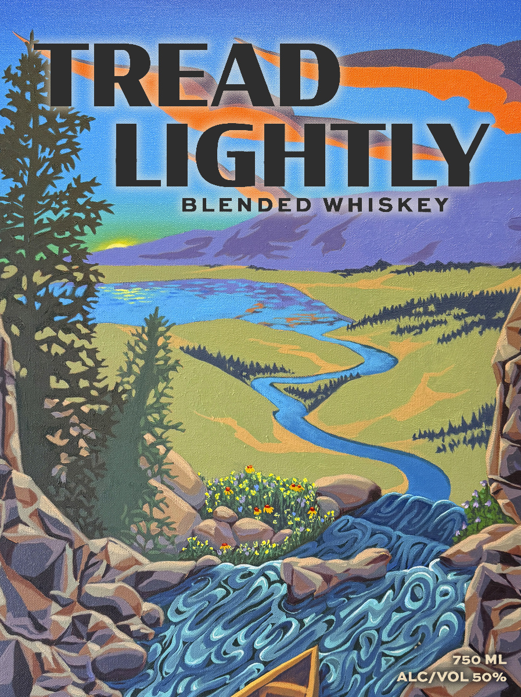

# TTB COLA Label Images - TTBID 26240001000310

**Brand Name:** TREAD LIGHTLY

**Issue Date:** 09/21/2026

**Origin Code:** 13

**Product Class/Type:** 137

**Source:** [TTB Public COLA Registry](https://ttbonline.gov/colasonline/viewColaDetails.do?action=publicFormDisplay&ttbid=26240001000310)

## Label Images

### Back Label

### Front Label

## Extracted Label Text

*Text extracted via OCR - may contain errors*

### Back Label

DRYw®LAND YX WOODS

DISTILLERS HIGH MOUNTAIN DISTILLERY

TREAD LIGHTLY IS ACOLLABORATION BETWEEN WOOD'S
HIGH MOUNTAIN DISTILLERY AND DRY LAND DISTILLERS
TO CREATE AN ICONIC COLORADO WHISKEY. IT IS A
BLEND OF TWO AWARD-WINNING SPIRITS - THE HIGH
OUNTAIN, ADVENTUROUS FLAVORS FROM WOOD'S
TENDERFOOT MALT WHISKEY AND THE ARTISANAL
FLAVORS FROM DRY LAND ANTERO GRAIN WHISKEY.
THIS RARE SPIRIT IS CELEBRATED WITH ORIGINAL LABEL
ARTWORK BY COLORADO ARTIST JOHN CROSS.

AGED A MINIMUM
READ THE STORY OF
PRODUCT OF USA THIS UNIQUE WHISKEY OF 1 YEAR

DISTILLED AND
BOTTLED BY DRY LAND 3
DISTILLERS,

LONGMONT, CO
IN COLLABORATION

i
WITH WOOD'S HIGH pert 6 ootz6o1831
MOUNTAIN DISTILLERY, 7
SALIDA, CO

GOVERNMENT WARNING:

(1) ACCORDING TO THE SURGEON GENERAL, WOMEN SHOULD NOT
DRINK ALCOHOLIC BEVERAGES DURING PREGNANCY BECAUSE OF THE
RISK OF BIRTH DEFECTS. (2) CONSUMPTION OF ALCOHOLIC BEVERAGES
IMPAIRS YOUR ABILITY TO DRIVE A CAR OR OPERATE MACHINERY, AND
MAY CAUSE HEALTH PROBLEMS.

### Front Label

TREAD
LIGHTLY
BLENDED
WHISKEY
750 ML
ALCIVOL 50%
