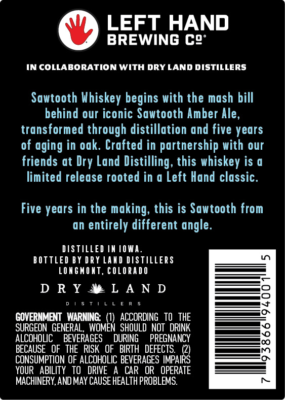

# TTB COLA Label Images - TTBID 26240001000326

**Brand Name:** LEFT HAND

**Fanciful Name:** SAWTOOTH

**Issue Date:** 09/16/2026

**Origin Code:** 13

**Product Class/Type:** 140

**Source:** [TTB Public COLA Registry](https://ttbonline.gov/colasonline/viewColaDetails.do?action=publicFormDisplay&ttbid=26240001000326)

## Label Images

### Back Label

### Front Label

## Extracted Label Text

*Text extracted via OCR - may contain errors*

*1 image(s) excluded: text did not meet readability threshold*

### Back Label

LEFT HAND
BREWING Co"

IN COLLABORATION WITH DRY LAND DISTILLERS

Sawtooth Whiskey begins with the mash bill
behind our iconic Sawtooth Amber Ale,
transformed through distillation and five years
of aging in oak. Crafted in partnership with our
friends at Dry Land Distilling, this whiskey is a
limited release rooted in a Left Hand classic.

Five years in the making, this is Sawtooth from
an entirely different angle.

DISTILLED IN IOWA.
BOTTLED BY DRY LAND DISTILLERS
LONGMONT, COLORADO

DRYM®@LAND

DisTiLLeRs

GOVERNMENT WARNING: (1) ACCORDING TO THE
SURGEON GENERAL, WOMEN SHOULD NOT DRINK
ALCOHOLIC BEVERAGES DURING PREGNANCY
BECAUSE OF THE RISK OF BIRTH DEFECTS. (2)
CONSUMPTION OF ALCOHOLIC BEVERAGES IMPAIRS
YOUR ABILITY TO DRIVE A CAR OR OPERATE
MACHINERY, AND MAY CAUSE HEALTH PROBLEMS.
