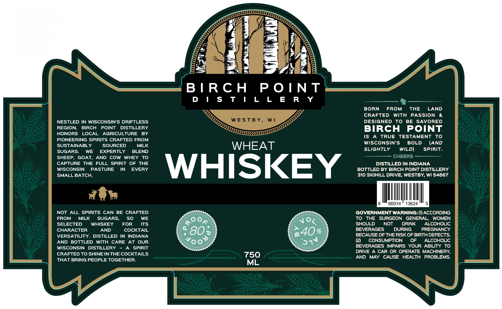

# TTB COLA Label Images - TTBID 26240001000363

**Brand Name:** BIRCH POINT DISTILLERY

**Issue Date:** 10/01/2026

**Origin Code:** 48

**Product Class/Type:** 140

**Source:** [TTB Public COLA Registry](https://ttbonline.gov/colasonline/viewColaDetails.do?action=publicFormDisplay&ttbid=26240001000363)

## Label Images

### Label 1

## Extracted Label Text

*Text extracted via OCR - may contain errors*

### Label 1

B I Rc H
P 0 IN T
D | $ T | L L E R Y
BORN
FROM
THE
LAND
CRAFTED
WIth
PASSION
NESTLED IN WISCONSIN'S DRIFTLESS
WESTB Y,
W |
DESIGNED
To
BE
SAVORED
REGION;
BIRCH
POINT
DISTILLERY
BIRCH
POINT
HONORS
LOCAL
AGRICULTURE
BY
IS
TRUE
TESTAMENT
To
PIONEERING SPIRITS CRAFTED FROM
WISCONSIN'S
BOLD
(AND
SUSTAINABLY
SOURCED
MILK
WHEAT
SUGARS.
WE
EXPERTLY
BLEND
SLIGHTLY
WILD)
Spirit;
SHEEP
GOAT,
AND
cOW
WHEY
To
ChEERS
CAPTURE
THE FULL SPIRIT OF
THE
DISTILLED IN INDIANA
WISCONSIN
PASTURE
IN
EVERY
WHISKEY
BOTTLED BY BIRCH POINT DISTILLERY
SMALL BATCH:
310 SKIHILL DRIVE, WESTBY, WI 54667
60014
13624
NOT ALL SPIRITS CAN BE CRAFTED
GOVERNMENT WARNING: (1) ACCORDING
FROM
MILK
SUGARS,
SO
WE
Voz
TO
THE
SURGEON
GENERAL
WOMEN
SELECTED
WHISKEY
FOR
ITS
SHOULD
NOT
DRINK
ALCOHOLIC
CHARACTER
AND
COCKTAIL
801
040%
BEVERAGES
DURING
PREGNANCY
VERSATILITY
DISTILLED
IN INDIANA
BECAUSE OF THE RISK OF BIRTH DEFECTS:
AND BOTTLED
With CARE
AT
OUR
0
(2)
CONSUMPTION
OF
ALCOHOLIC
WISCONSIN
DISTILLERY
SPIRIT
BEVERAGES
IMPAIRS YOUR ABILITY TO
CRAFTED TO SHINE IN THE COCKTAILS
750
DRIVE
A CAR OR OPERATE MACHINERY,
AND
MAY
CAUSE
HEALTH
PROBLEMS:
THAT BRING PEOPLE TOGETHER
ML
'08
574
