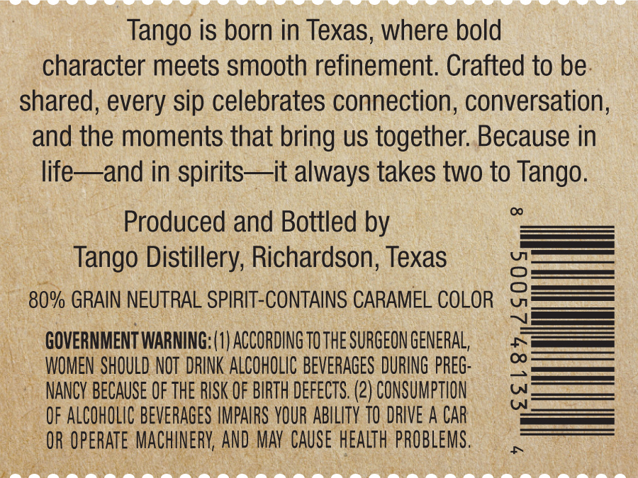
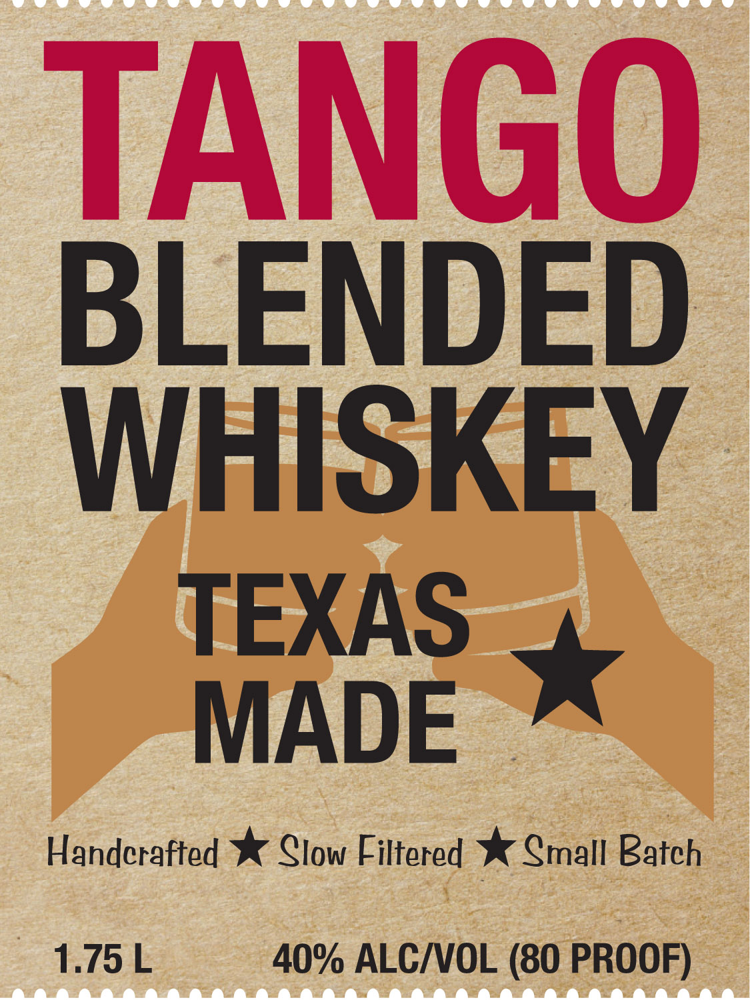

# TTB COLA Label Images - TTBID 26240001000412

**Brand Name:** TANGO

**Issue Date:** 09/08/2026

**Origin Code:** 44

**Product Class/Type:** 137

**Source:** [TTB Public COLA Registry](https://ttbonline.gov/colasonline/viewColaDetails.do?action=publicFormDisplay&ttbid=26240001000412)

## Label Images

### Back Label

### Front Label

## Extracted Label Text

*Text extracted via OCR - may contain errors*

**Detected Proof:** 80

### Back Label

Tango is born in Texas, where bold
character meets smooth refinement. Crafted to be
shared, every sip celebrates connection, conversation;
and the moments that bring us together: Because in
life
and in spirits it always takes two to Tango.
Produced and Bottled by
Tango Distillery; Richardson; Texas
80% GRAIN NEUTRAL SPIRIT-CONTAINS CARAMEL COLOR
0
GOVERNMENT WARNING; (1| ACCORDING TO THE SURGEON GENERAL,
WOMEN SHOULD NOT  DRINK ALCOHOLIC BEVERAGES DURING pREG:
E
NANCY BECAuSE OF the RISK OF BIRTH defects: (2) CONSUMPTION
OF ALCOHOLIC BEVERAgeS IMPAIRS YOUR ABILITY TO DRIVE A CAR
OR OperATe MachinerV; AND MAV  CAuSe health PROBLEMS .

### Front Label

TANGO
BLENDED
WHISKEY
TEXAS
MADE
Handcrafted
Clow Filtered
Cmall Batch
1.75 L
40% ALCIVVOL (80 PROOF)
