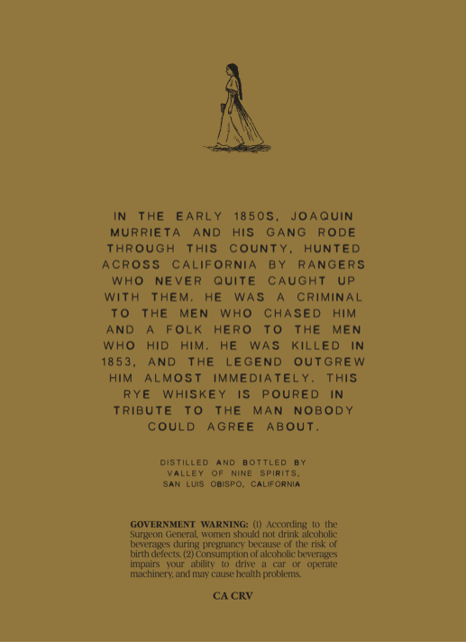
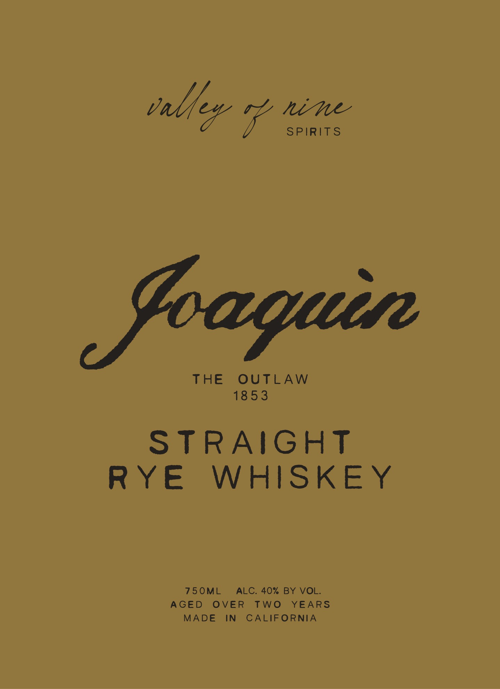

# TTB COLA Label Images - TTBID 26240001000504

**Brand Name:** VALLEY OF NINE SPIRITS

**Fanciful Name:** JOAQUIN

**Issue Date:** 09/14/2026

**Origin Code:** 01

**Product Class/Type:** 102

**Source:** [TTB Public COLA Registry](https://ttbonline.gov/colasonline/viewColaDetails.do?action=publicFormDisplay&ttbid=26240001000504)

## Label Images

### Back Label

### Front Label

## Extracted Label Text

*Text extracted via OCR - may contain errors*

### Back Label

THE
EARLY
18 5 05 ,
JOAQUIN
MURRIETA
AND
HIS
GANG
RODE
ThRoUGh
ThIS
counTY
HUNTED
Across
CALIFORNIA
BY
RANGERS
WhO
NEVER
Quite
CaUGhT
UP
With
Them;
HE
WAS
CRIMiNAL
To
ThE
MEN
WHO
CHASED
HiM
AND
FOLk
Hero
To
The
MEN
WHO
HID
HIM.
HE
WAS
KILLED
18 5 3
AND
The
LEGEND
outGrew
HIM
ALMOST
IMMEDIATELY.
ThIS
RYE
WhISKEY
POURED
TRIBUTE
To
ThE
MAN
NOBodY
COULD
AGREE
ABouT.
DISTILLED
BOTTLED
VaLLEY
NIME
spirits;
SAN Luis
OBISPO
CALIFORNIA
GOVERNMENT
WARNING: (I)
AccOrding
Surgcon
General
Cuee
shoukd not drink alcoholic
beverages thuring pregnancy because ouathe risk
birth defects (2) Consumption of alccholic beverages
impalts
ability
@MVC
operate
machinery. alncl maly Cause health [
problems
CA CRV

### Front Label

tal flex ian

SPIRITS

THE OUTLAW

Tees)

STRAIGHT

RYE

WHISKEY

AGED OVER TWO YEARS

750ML_ ALC. 40% BY VOL

MADE IN CALIFORNIA
