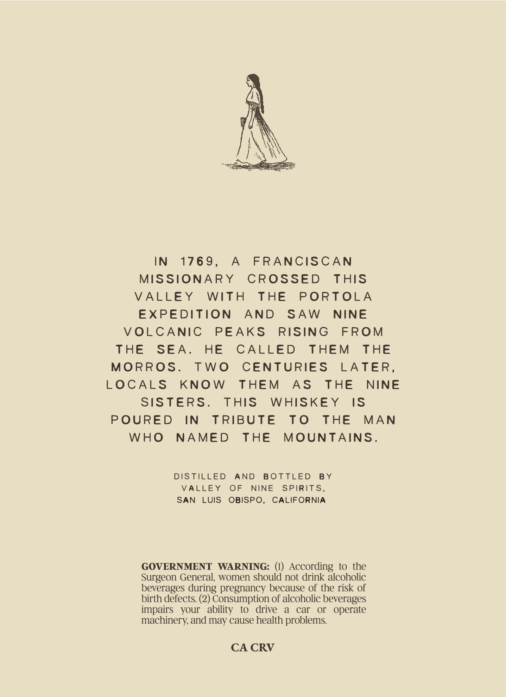
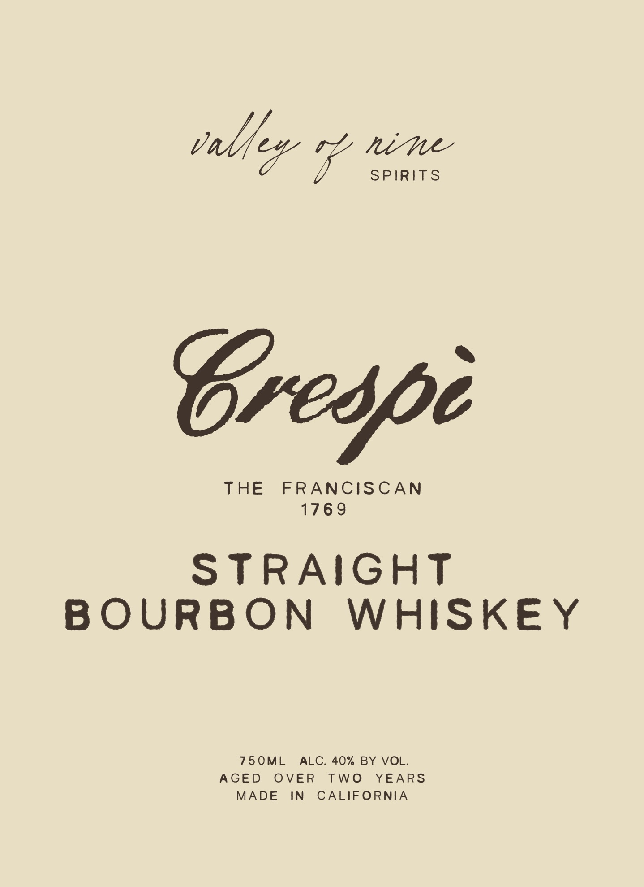

# TTB COLA Label Images - TTBID 26240001000507

**Brand Name:** VALLEY OF NINE SPIRITS

**Fanciful Name:** CRESPI

**Issue Date:** 09/14/2026

**Origin Code:** 01

**Product Class/Type:** 101

**Source:** [TTB Public COLA Registry](https://ttbonline.gov/colasonline/viewColaDetails.do?action=publicFormDisplay&ttbid=26240001000507)

## Label Images

### Back Label

### Front Label

## Extracted Label Text

*Text extracted via OCR - may contain errors*

### Back Label

IN
176 9 ,
A
FRANCISCAN
MiSSioNARY
CROSSED
thiS
VALLEY
WiTH
THE
PORTOLA
EXPEDiTiON
AND
SAw
NINE
VOLCANIC
PEAKS
RisinG
FROM
THE
SEA_
HE
CALLED
THEM
THE
MORROS
Two
CENTURIES
LATER
LOCALS
KnOW
THEM
As
ThE
NINE
SISERS.
ThIS
WHISKE Y
IS
POURED
iN
TRIBUtE
To
THE
MAN
WHO
NAMED
THE
MountAiNS_
DISTILLED
AND
B OTTLED
B Y
VALLEY
OF
NINE
SPiriTS_
SAN
LUIS
OBISPO_
CALIFORNIA
GOVERNMENT
WARNING:
According to the
Surgeon General, women should not drink alcoholic
beverages during pregnancy because of the risk of
birth defects: (2) Consumption of alcoholic beverages
impairs
your   ability
to
drive
a
car
or
operate
machinery and may cause health problems
CA CRV

### Front Label

talfev if ee

SPIRITS

Walls et adi

STRAIGHT
BOURBON WHISKEY

AGED OVER TWO YEARS
MADE IN CALIFORNIA
