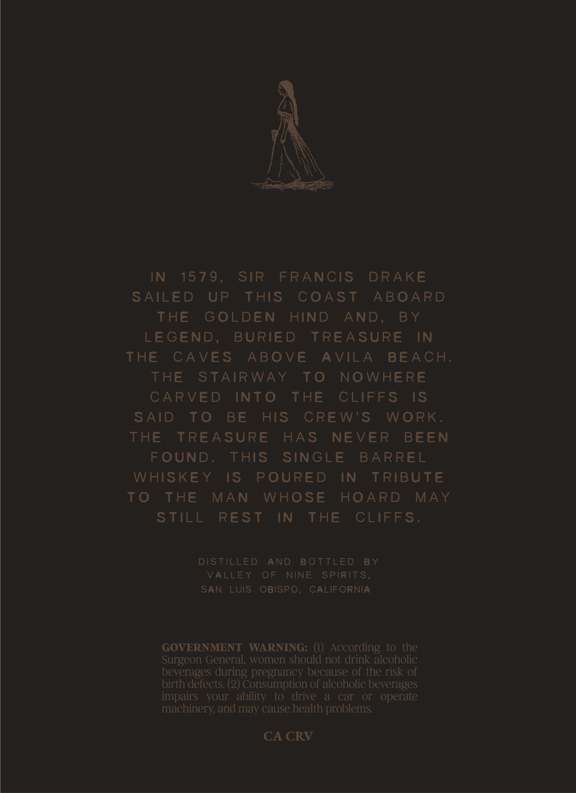
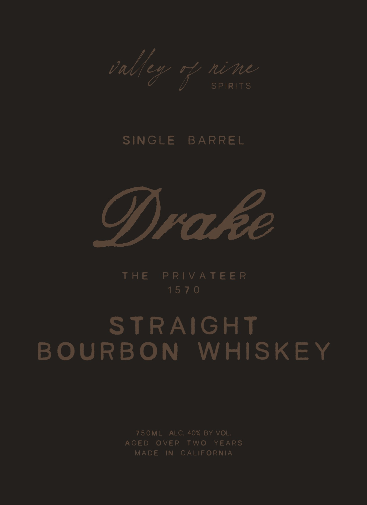

# TTB COLA Label Images - TTBID 26240001000515

**Brand Name:** VALLEY OF NINE SPIRITS

**Fanciful Name:** DRAKE

**Issue Date:** 09/14/2026

**Origin Code:** 01

**Product Class/Type:** 101

**Source:** [TTB Public COLA Registry](https://ttbonline.gov/colasonline/viewColaDetails.do?action=publicFormDisplay&ttbid=26240001000515)

## Label Images

### Back Label

### Front Label

## Extracted Label Text

*Text extracted via OCR - may contain errors*

### Back Label

IN 1579, SIR FRANCIS DRAKE
SAILED UP THIS COAST ABOARD
THE GOLDEN HIND AND, BY
LEGEND, BURIED TREASURE IN
THE CAVES ABOVE AVILA BEACH.
THE STAIRWAY TO NOWHERE
CARVED INTO THE CLIFFS IS
SAID TO BE HIS CREW'S WORK.
THE TREASURE HAS NEVER BEEN
FOUND. THIS SINGLE BARREL
WHISKEY IS POURED IN TRIBUTE
TO THE MAN WHOSE HOARD MAY
STEEL REST IN THE CEIFES:

DISTILLED AND BOTTLED BY
VALLEY OF NINE SPIRITS,
SAN LUIS OBISPO, CALIFORNIA

GOVERNMENT WARNING: (I) According to the
Surgeon General, women should not drink alcoholic
beverages during pregnancy because of the risk of
birth defects. (2) Consumption of alcoholic beverages
impairs your ability to drive a car or operate
machinery, and may cause health problems.

CA CRV

### Front Label

talfev nod

SPIRITS

SINGLE BARREL

Drake

THES RV IA TEER

1570

STRAIGHT

BOURBON WHISKEY

750ML ALC. 40% BY VOL

AGED OVER TWO

MADE IN CALIFORNIA

YEARS
