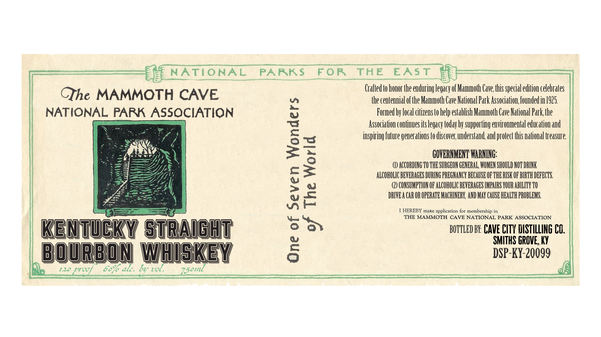
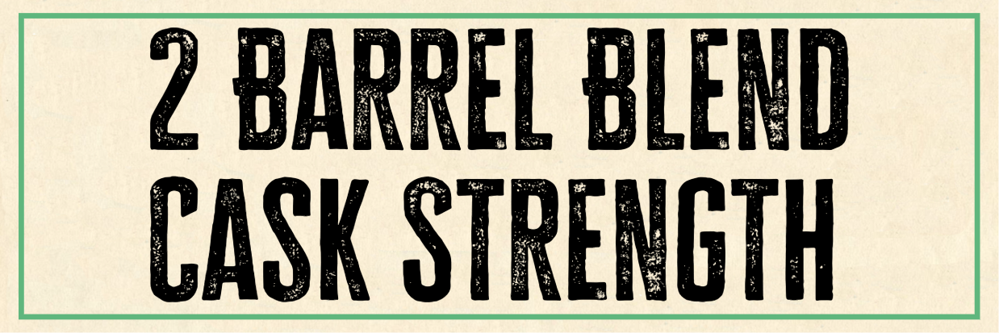

# TTB COLA Label Images - TTBID 26241001000035

**Brand Name:** THE MAMMOTH CAVE NATIONAL PARK ASSOCIATION

**Issue Date:** 09/11/2026

**Origin Code:** 22

**Product Class/Type:** 101

**Source:** [TTB Public COLA Registry](https://ttbonline.gov/colasonline/viewColaDetails.do?action=publicFormDisplay&ttbid=26241001000035)

## Label Images

### Label 1

### Label 2

## Extracted Label Text

*Text extracted via OCR - may contain errors*

*1 image(s) excluded: text did not meet readability threshold*

### Label 1

>

Ef] NATIONAL PARKS

FOR THE EAST

Crafted to honor the enduring legacy of Mammoth Cave, this special edition celebrates

CThe MAMMOTH CAVE

the centennial of the Mammoth Cave National Park Association, founded in 1925

NATIONAL PARK ASSOCIATION

Formed by local citizens to help establish Mammoth Cave National Park, the

Association continues its legacy today by supporting environmental education and

ow

inspiring future generations to discover, understand, and protect this national treasure.

GOVERNMENT WARNING

() ACCORDING T0 THE SURGEON GENERAL, WOMEN SHOULD NOT DRINK

c=

ALCOHOLIC BEVERAGES DURING PREGNANCY BECAUSE OF THE RISK OF BIRTH DEFECTS.

(2) CONSUMPTION OF ALCOHOLIC BEVERAGES IMPAIRS YOUR ABILITY 70

> VW

DRIVEA CAR OR OPERATE MACHINERY, AND MAY CAUSE HEALTH PROBLEMS.

ae

yu

1 HEREBY make application for membership

THE MAMMOTH CAVE NATIONAL PARK ASSOCIATION

BOTTLED BY: CAVE CITY DISTILLING CO

KEN TwEKY sTRAl GHiTl

SMITHS GROVE, KY

BOUR

ON WHISKEY

DSP-KY-20099

120

00

df

60% ale. by vol.

Vhs oml
