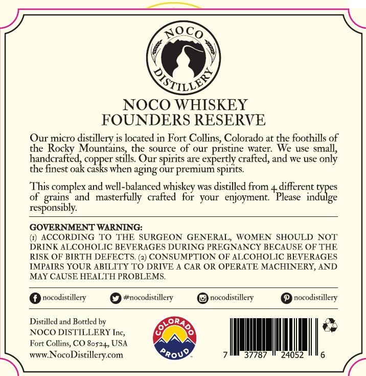
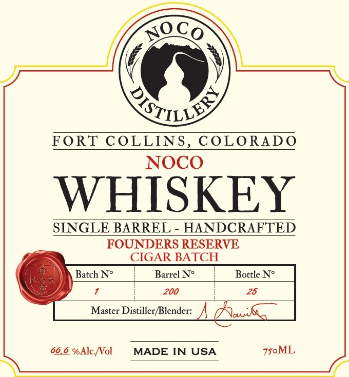

# TTB COLA Label Images - TTBID 26241001000114

**Brand Name:** NOCO DISTILLERY

**Issue Date:** 09/08/2026

**Origin Code:** 13

**Product Class/Type:** 140

**Source:** [TTB Public COLA Registry](https://ttbonline.gov/colasonline/viewColaDetails.do?action=publicFormDisplay&ttbid=26241001000114)

## Label Images

### Back Label

### Front Label

## Extracted Label Text

*Text extracted via OCR - may contain errors*

**Detected Proof:** 133.2

### Back Label

NoCo
NOCO WHISKEY
FOUNDERS RESERVE
Our micro distillery is located in Fort Collins, Colorado at the foothills of
the Rocky Mountains
the source of our
pristine water:
We use small,
handcrafted; copper stils Our spirits are expertly crafted, and we use only
the finest oak casks when aging Our premiun spirits
This complex and well-balanced
was distilled from 4 different
of
and
masterfully   crafted   for  your   enjoyment
Please
{aRes
responsibly:
GOVERNMENT WARNING:
(1) ACCORDING
TO THE SURGEON GENERAL; WOMEN SHOULD NOT
DRINK ALCOHOLIC BEVERAGHS DURING PREGNANCY BECAUSE OF THK
RISK OF' BIRTH DEFECTS. (2) CONSUMPTION OF ALCOHOLIC BEVERAGES
IMPAIRS YOUR ABILITY TO DRIVE
CAR OR OPERATE MACHINERY, AND
MAY CAUSE HEALTH PROBLEMS_
nocodistillery
#nocodistillery
nocodistillery
nocodistillery
Distilled and Bottled by
ORA
NOCO DISTILLERY Inc,
Fort Collins, CO 8o524, USA
WWW.
NocoDistillerycom
~rouo
37787
24052
QTILLS
whiskey
grains

### Front Label

nOCo
QILLVV
FORT COLLINS
C OLORADO
NOCO
WHISKEY
SINGLE BARREL
HANDCRAFTED
FOUNDERS RESERVE
CIGAR BATCH
Batch No
Barrel No
Bottle No
200
25
Master Distiller/Blender:
66.6 %Alc-Nol
MADE IN USA
750ML
