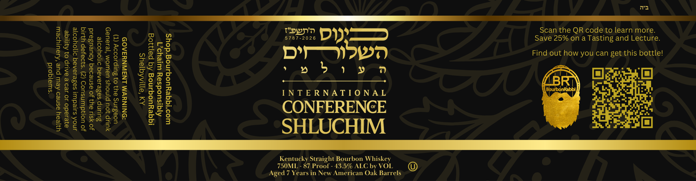

# TTB COLA Label Images - TTBID 26242001000001

**Brand Name:** SHLUCHIM

**Issue Date:** 09/03/2026

**Origin Code:** 22

**Product Class/Type:** 101

**Source:** [TTB Public COLA Registry](https://ttbonline.gov/colasonline/viewColaDetails.do?action=publicFormDisplay&ttbid=26242001000001)

## Label Images

### Label 1

## Extracted Label Text

*Text extracted via OCR - may contain errors*

**Detected Proof:** 87
**Detected Age:** 7 Years

### Label 1

Scan the QR code to learn more.
Save 25% on a Tasting and Lecture.
Find out how you can get this bottle!

Ms
own
» 9

DY)
) =) eee ))
» b

3)

Pop'n
5787-2026

CONFERENGE
Kentucky Straight Bourbon Whiskey
750ML - 87 Proof - 43.5% ALC by VOL

Aged 7 Years in New American Oak Barrels

,

Shop.BourbonRabbi.com
L’chaim Responsibly
Bottled by BourbonRabbi
Shelbyville, KY

GOVERNMENT WARNING:

(1) According to the Surgeon
General, women should not drink
alcoholic beverages during
pregnancy because of the risk of
birth defects. (2) Consumption of
alcoholic beverages impairs your
ability to drive a car or operate
machinery, and may cause health
problems.

©
