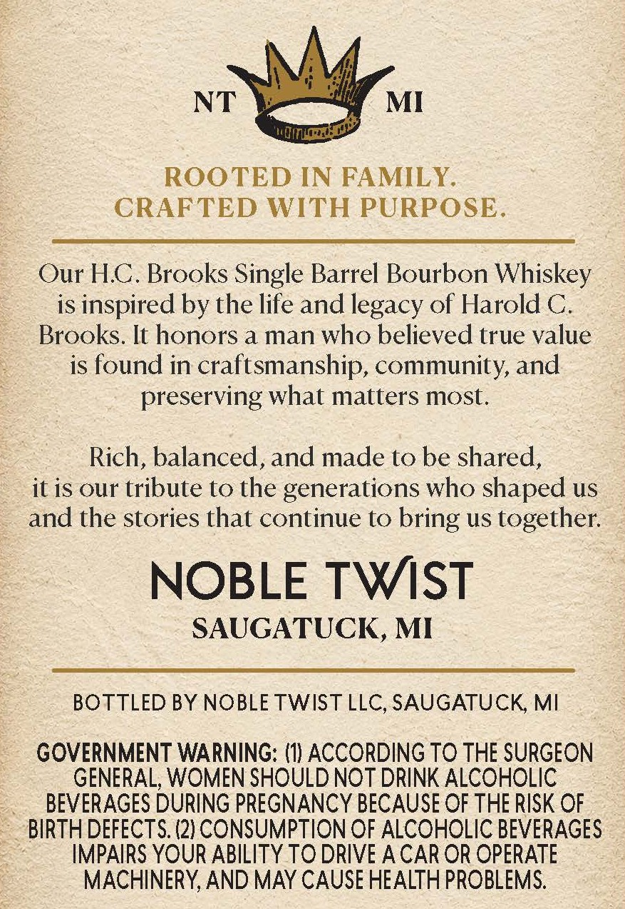
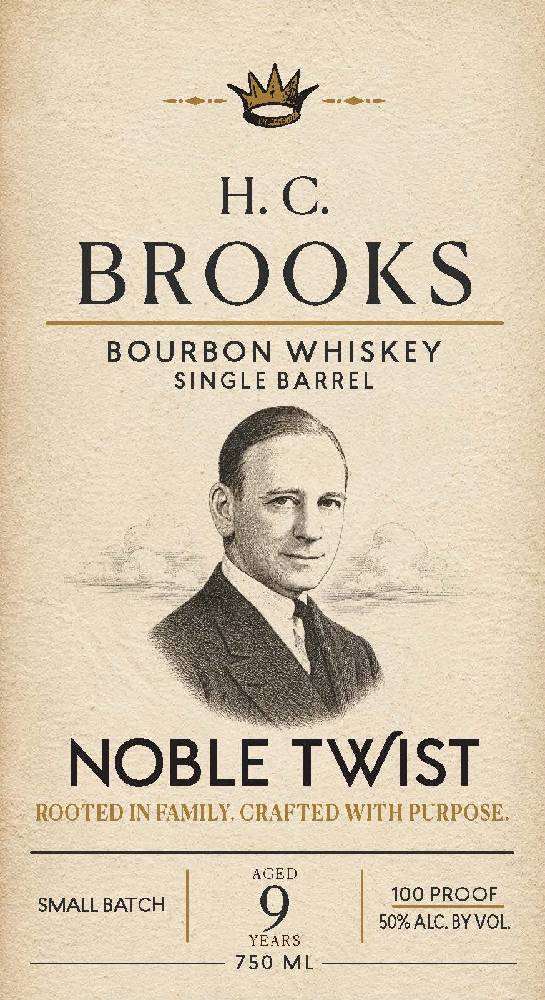

# TTB COLA Label Images - TTBID 26242001000067

**Brand Name:** NOBLE TWIST

**Fanciful Name:** H.C. BROOKS

**Issue Date:** 09/10/2026

**Origin Code:** 06

**Product Class/Type:** 141

**Source:** [TTB Public COLA Registry](https://ttbonline.gov/colasonline/viewColaDetails.do?action=publicFormDisplay&ttbid=26242001000067)

## Label Images

### Back Label

### Front Label

## Extracted Label Text

*Text extracted via OCR - may contain errors*

**Detected Proof:** 100

### Back Label

NT

MI

ROOTED IN FAMILY.

CRAFTED WITH PURPOSE.

Our H.C. Brooks Single Barrel Bourbon Whiskey

is inspired by the life and legacy of Harold C.

Brooks. It honors a man who believed true value

is found in craftsmanship, community, and

preserving what matters most.

Rich, balanced, and made to be shared,

it is our tribute to the generations who shaped us

and the stories that continue to bring us together.

NOBLE TWIST

SAUGATUCK, MI

BOTTLED BY NOBLE TWIST LLC, SAUGATUCK, MI

GOVERNMENT WARNING: (1) ACCORDING TO THE SURGEON

GENERAL, WOMEN SHOULD NOT DRINK ALCOHOLIC

BEVERAGES DURING PREGNANCY BECAUSE OF THE RISK OF

BIRTH DEFECTS. (2) CONSUMPTION OF ALCOHOLIC BEVERAGES

IMPAIRS YOUR ABILITY TO DRIVE A CAR OR OPERATE

MACHINERY, AND MAY CAUSE HEALTH PROBLEMS.

### Front Label

---ply ---

BROOKS

BOURBON WHISKEY

SINGLE BARREL

ica bal

NOBLE TWIST

ROOTED IN FAMILY, CRAFTED WITH PURPOSE

AGED

SMALL BATCH

100 PROOF

9

50% ALC. BY VOL

YEARS

750 ML
