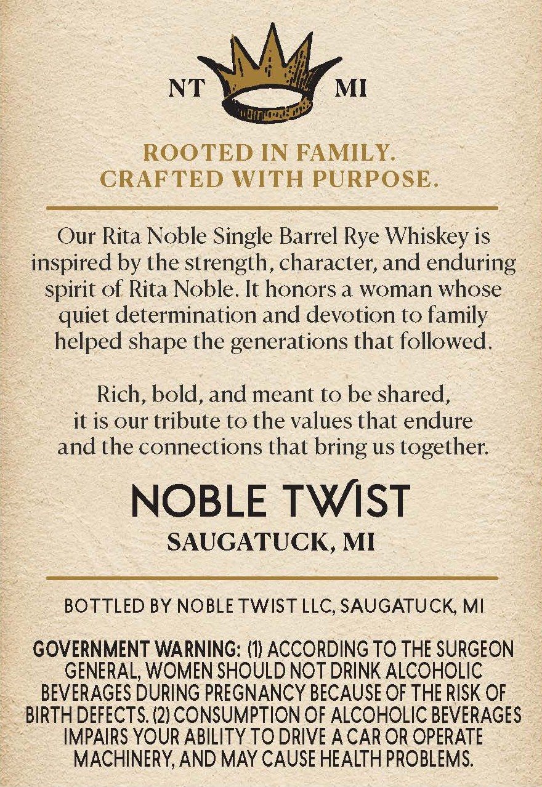
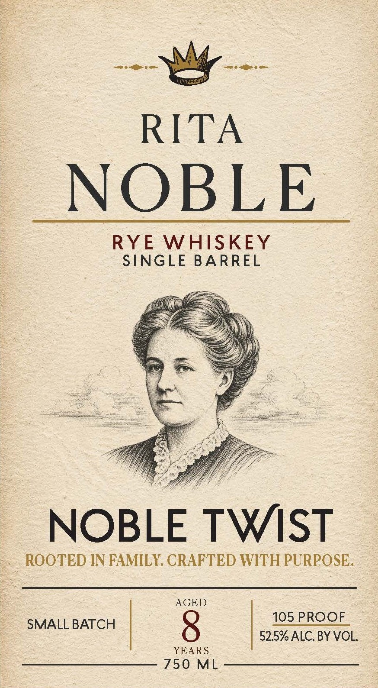

# TTB COLA Label Images - TTBID 26242001000069

**Brand Name:** NOBLE TWIST

**Fanciful Name:** RITA NOBLE

**Issue Date:** 09/03/2026

**Origin Code:** 06

**Product Class/Type:** 142

**Source:** [TTB Public COLA Registry](https://ttbonline.gov/colasonline/viewColaDetails.do?action=publicFormDisplay&ttbid=26242001000069)

## Label Images

### Back Label

### Front Label

## Extracted Label Text

*Text extracted via OCR - may contain errors*

**Detected Proof:** 105

### Back Label

NT
MI
ROOTED IN FAMILY.
CRAFTED WITH PURPOSE:
Our Rita Noble Single Barrel Rye Whiskey is
inspired by the strength, character, and enduring
spirit of Rita Noble. It honors a woman whose
quiet determination and devotion to family
helped shape the generations that followed.
Rich, bold, and meant to be shared,
it is our tribute to the values that endure
and the connections that bring us together:
NOBLE TWST
SAUGATUCK, MI
BOTTLED BY NOBLE TWIST LLC, SAUGATUCK MI
GOVERNMENT WARNING: (11 ACCORDING TO THE SURGEON
GENERAL; WOMEN SHOULD NOT DRINK ALCOHOLIC
BEVERAGES DURING PREGNANCY BECAUSE OF THE RISK OF
BIRTH DEFECTS (2) CONSUMPTION OF ALCOHOLIC BEVERAGES
IMPAIRS YOUR ABILITY TO DRIVE A CAR OR OPERATE
MACHINERY,AND MAY CAUSE HEALTH PROBLEMS.

### Front Label

RITA
NOBLE
RYE
WHISKEY
SINGLE BARREL
NOBLE TWST
ROOTED IN FAMILY CRAFTED WITH PURPOSE
AGED
105 PROOF
SMALL BATCH
52.5%ALC. BY VOL
YEARS
750
ML
