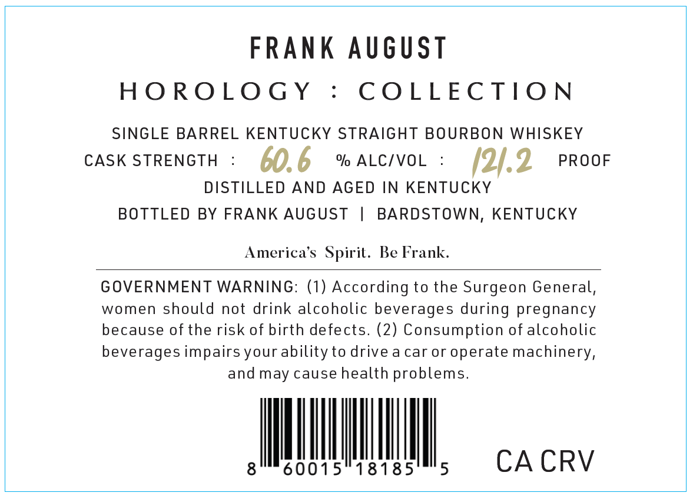
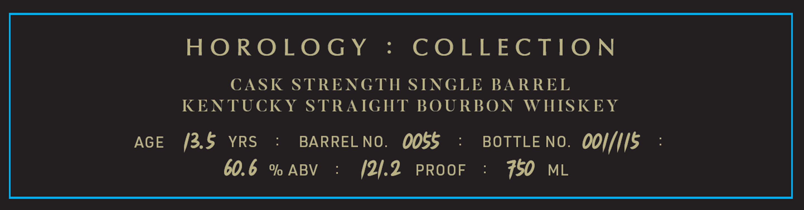

# TTB COLA Label Images - TTBID 26243001000051

**Brand Name:** FRANK AUGUST

**Issue Date:** 09/03/2026

**Origin Code:** 22

**Product Class/Type:** 101

**Source:** [TTB Public COLA Registry](https://ttbonline.gov/colasonline/viewColaDetails.do?action=publicFormDisplay&ttbid=26243001000051)

## Label Images

### Back Label

### Label 1

## Extracted Label Text

*Text extracted via OCR - may contain errors*

**Detected Proof:** 121.2
**Detected Age:** 13.5 Years

### Back Label

FRAnK August
HO ROLO GY
COLLECTIO N
SINGLE BARREL KENTUCKY STRAIGHT BOURBON WHISKEY
CASK STRENGTH
60.6
% ALCIVOL
12/.2
PROOF
DISTILLED
AND AGED IN KENTUCKY
BOTTLED BY FRANK AUGUST
BARDSTOWN, KENTUCKY
America's   Spirit. Be Frank:
GOVERNMENT WARNING: (1) According to the Surgeon General,
women should not drink alcoholic beverages during pregnancy
because of the risk of birth defects. (2) Consumption of alcoholic
beverages impairs your ability to drive a car or operate machinery,
and may cause health problems.
8
60015
18185
5
CA CRV

### Label 1

HO ROLO GY
8
COLLEC TIO N
CASK STRENGTH SINGLE
BARREL
KENTUCKY STRAIGHT
BOURBON
WHISKEY
AGE
13.5
YRS
BARREL NO.
0055
BOTTLE NO
0oi/iis
60.6
%l ABV
121.2
PROOF
750
ML
